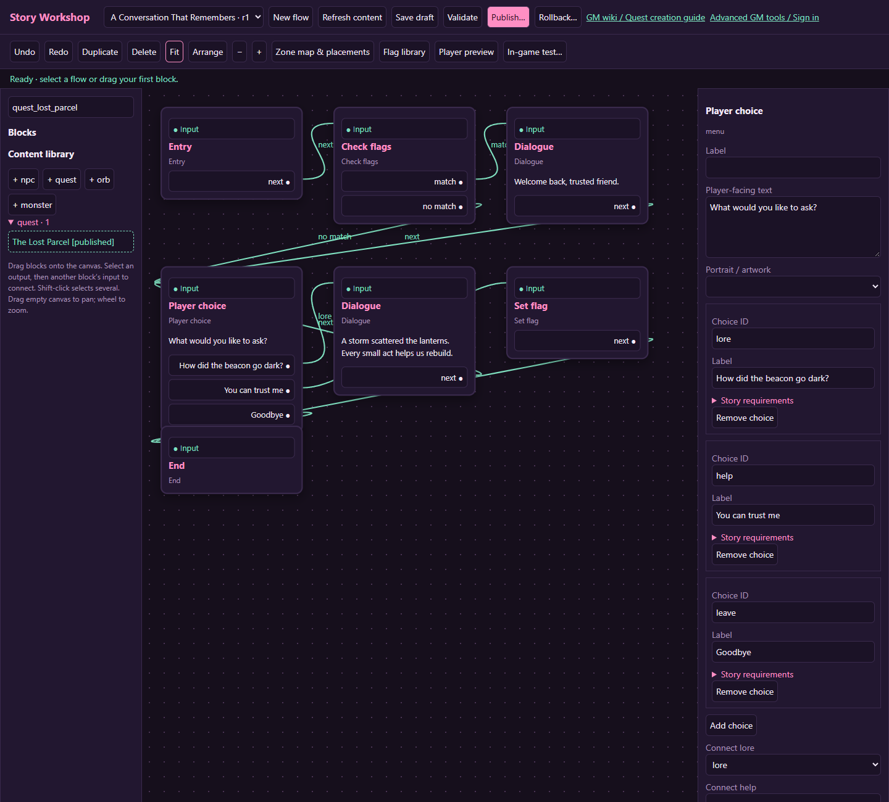
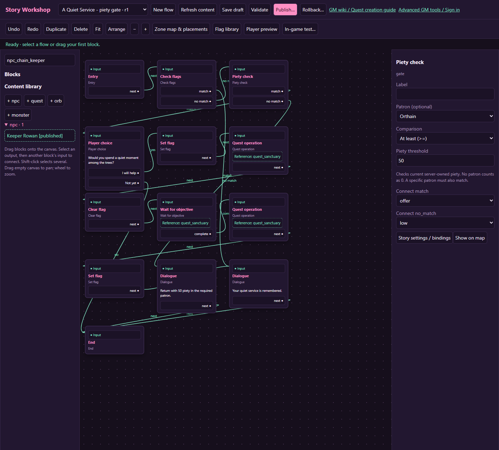

# Flow block reference

[Wiki home](index.md)

Every block has a stable generated ID and an editable label. Presentation text belongs only on blocks that display it. Connect every required output before publishing. A content reference points at a canonical record; it is not a copy you can change independently without affecting that record's other uses.

## Entry, Dialogue, and Narrative

| Block | Settings | Output | Behavior |
| --- | --- | --- | --- |
| Entry | Label | `next` | Names an explicit starting point; performs no gameplay mutation. |
| Dialogue | Text, optional portrait/artwork | `next` | Pauses for player continuation. |
| Narrative | Text, optional artwork | `next` | Presents a story page and pauses for continuation. |

Use Entry to make bindings readable. A binding can identify another valid node, but a clearly labeled Entry is easier to maintain. Several narrative pages should be several connected presentation blocks so each continuation is explicit.

Text and artwork are presentation. Merely writing “you receive a potion” does not grant an item; connect the appropriate Reward or Character effect.

## Player choice

Write the prompt and add up to eight choices. Each choice has a unique choice ID, visible label, and optional story requirements. The choice ID becomes its output port. Connect all choices, including refusal.

The server checks current requirements when the player chooses. Imported dialogue choices can retain numeric requirements as well as flags. Unavailable choices should not be the only way out of a scene: supply a fallback option unless you deliberately want the player to wait for an external change.

Changing a choice ID removes the meaning of the old connection. Recheck the graph after edits. For a quest branch, route the selected output through a Quest operation rather than changing only the displayed page.

## Check flags, Set flag, and Clear flag

Check flags evaluates All set, Any set, and None set and has `match` and `no_match` outputs. Set flag and Clear flag choose an active authored flag and continue through `next` after committing the value.

Use a Check flags near the beginning of a repeatable flow to route already-completed players away from one-time rewards. See [Flags](flags.md) for empty-group behavior and engine-owned restrictions.

Follow [A piety-gated quest](tutorial-piety.md) for a complete admission path, including protection against ordinary NPC offers bypassing the check.

## Piety check

Choose **Piety check** from the block palette. Set **Piety threshold** to a whole number from 0 to the faith system's maximum (currently 100), choose **At least**, **At most**, or **Exactly**, and optionally choose a **Patron**. Connect both `match` and `no_match`.

For example, select a patron, **At least**, and `50`: that patron's followers with 50 or more piety take `match`; lower piety and followers of other patrons take `no_match`. Leave Patron at **Any patron / no patron** when only the number matters. A character without a patron counts as 0, so an unrestricted ?Exactly 0? check includes them. With a specific patron selected, a character without that patron never matches.

The block reads current server-owned character faith when reached. It does not grant piety, change a patron, test equipment conformity, or read a client-supplied loadout value. Its authored threshold stays pinned for an active run while current character piety can change. Put a new check at each point where you need a fresh decision.

In Player preview, expand **Simulated conditions** and choose **Simulated patron** and **Simulated piety**. Changing either restarts the preview through the check. Test one value below, exactly at, and one value above the threshold, then test another patron. These preview values do not change a real character. In an isolated in-game test, the copied character starts with its actual faith; use the existing in-game GM faith controls inside that test when testing other faith states. **Use current preview flags** copies flags only, not simulated piety.

## Quest operation

Choose a canonical quest reference, then an operation:

| Operation | Required state | Result |
| --- | --- | --- |
| `accept` | Eligible quest; no conflicting active limit or unmet prerequisites | Creates/resumes an instance, or leaves the already-active instance in place |
| `claim` | Referenced quest is ready | Grants its normal rewards once and records the claim |
| `abandon` | Active referenced instance, if present | Marks it abandoned using normal quest semantics |
| `branch` | Quest is waiting for a branch choice | Selects the Branch ID if its current conditions pass |

All operations have `next`. They do not bypass eligibility, inventory capacity, reward caps or captured quest definitions. If you require travel back to an NPC before claiming, make that a task or another interaction in the design.

## Wait for objective

For an action tied to one objective, open the quest's own canvas, select that objective and add **Set flag on completion**. This attaches an **On completed → Set flag** action and does not need a running story flow. It is separate from the whole-quest wait described below. See [objective completion actions](quests.md#objective-completion-flags).

Choose Wait for `quest` to wait until the referenced quest has status ready or claimed. This is whole-quest readiness, not an arbitrary per-objective polling expression. Choose Wait for `flag` to wait for the configured flag condition. Output is `complete`.

The player can explore while waiting. Design an actual way for the requirement to become true: an available quest target, a world interaction, or a committed action from another allowed gameplay path. Do not put the only Set flag that satisfies the wait after the wait itself.

A quest branch choice can stall a wait for readiness. Resolve the branch through normal quest UI or a flow branch operation before expecting the quest to be complete.

## Automatic entry blocks

**When flag is set** and **When objective completes** are independent starting blocks with a `next` output and no input. Connect them to Battle, Dialogue or another action. Flag entries start once on an observed false-to-true change (or the first observed true value). Objective entries select a quest, stage and specific objective, and run once per accepted attempt, even before the quest is ready. Main-story completion does not consume these entries.

A parcel collection objective can connect directly to a Battle. Its count controls how many parcels must be collected first. Use one trigger per intended scene: an objective entry plus a flag entry for the same pickup schedules two scenes. Busy dialogue/combat defers the scene; an objective wait can suspend and resume around it. Select **Preview from this entry** or choose its start point in **In-game test**.

## Battle

Drag 1-3 monsters from the library onto the Battle. Its lineup accepts duplicates; remove slots on the card or replace/reorder them in the inspector. Outputs are `victory`, `defeat`, and `retreat`; all three need destinations. The server creates and starts an ordinary authoritative PvE encounter using all captured monster definitions. Victory waits for every lineup member. Existing eligibility and party/follower limits apply.

The runner waits for authoritative settlement. Mandatory defeat handling finishes before the defeat branch. A disconnected client does not award itself victory. See [Battles](monsters-rewards.md#battle-blocks-and-party-behavior).

## Reward

Configure XP, coins, RPP, and item rows. An item row needs an existing item ID and count. Output is `next`. Rewards use stable execution receipts; retries of the same committed step do not duplicate an award.

That protection is per execution, not a substitute for story design. A repeatable flow or an intentional loop can reach a reward again as a new step or run. Use quest claim receipts or an authored flag guard for one-time rewards.

## Character effect

Add effect rows with a supported type, bounded amount, and item where required. Output is `next`. Supported types are heal, damage, wet, tum, shame_delta, stamina_drain, excitement_down, inco_down, give_item, force_equip_item, and replace_diaper.

These reuse existing game effects and clamps; damage here is not a replacement for a battle or its defeat processing. See the [effect reference](monsters-rewards.md#character-effects) for meanings and authoring cautions.

## Travel

Choose an existing destination zone. Output is `next`. The server uses the existing travel service and location rules. This block does not define a custom terrain map, invent a new zone, or guarantee a chosen arbitrary coordinate.

Explain the transition before it happens. Test the arrival location and any following encounter or interaction in the destination. A travel into another story's trigger should not be used to create conflicting simultaneous stories.

## Spawn monster

Choose a monster reference. Output is `next`. This creates a personal story-owned, nonroaming, nonrespawning monster near the owner on a valid reachable tile; it does not automatically start the battle.

Use Battle when the next story action is an immediate fight. Use Spawn monster when the player should encounter it through world play, and pair it with an appropriate quest objective or wait if later story steps depend on defeating it. Spawning alone does not wait for a kill and is not a general shared-monster placement tool.

## End

End marks the current run complete and has no output. It does not automatically claim quests, set flags, remove every spawned object, or clear unrelated progress. Put required completion operations before it.

For a nonrepeatable flow, any End completes that flow for the character, including an End reached by refusal. If refusal should allow another offer, make the flow repeatable and guard its completed/rewarded path, as in the [first quest tutorial](first-quest.md).

## Loops and unreachable content

Automatic execution loops are rejected. Put real player interaction or an intentional battle boundary into a revisitable story, and still review reward repetition. A ready objective wait can complete immediately and must not be treated as an automatic-loop safety mechanism.

Unreachable blocks produce warnings. A warning does not prove the design is wrong, but an unused victory scene or disconnected reward often indicates a missed connection. Inspect each warning before publication.
