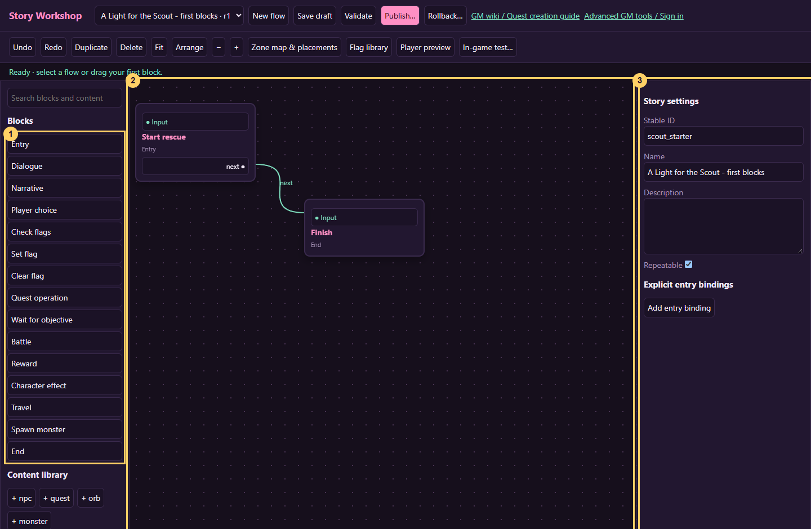
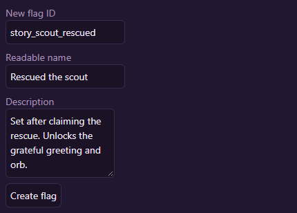
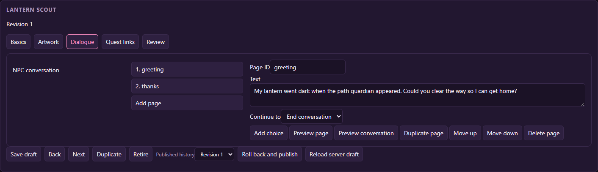
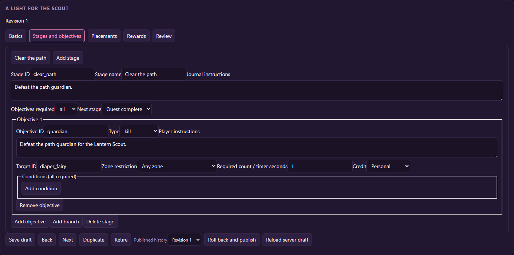
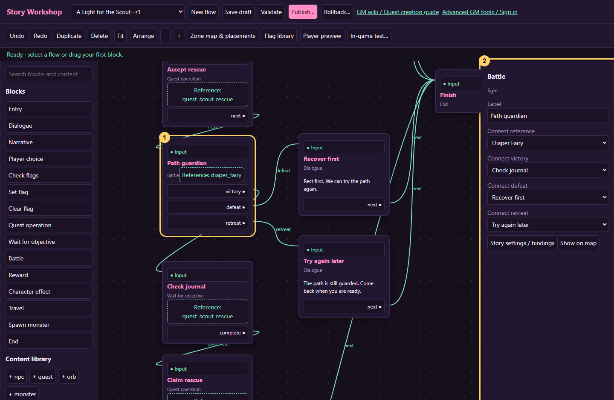
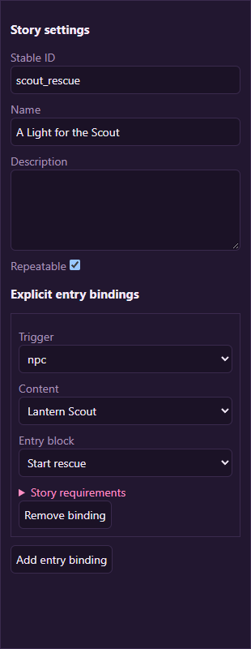
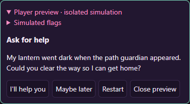
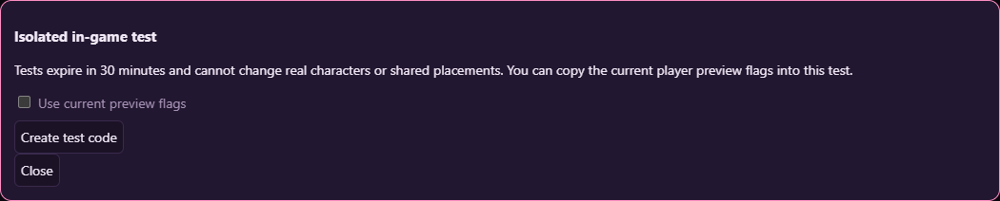
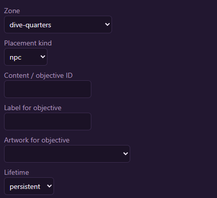
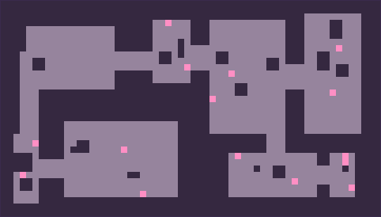

# Build your first quest

> **Content block controls:** Quest stages, objectives, NPC pages/choices and orb pages now open as blocks with a small inspector. Keep generated stable IDs; connect destinations using the canvas or its selectors. Use **Save content drafts**, **Publish content**, and **Back to story flow**. Older images below show the previous forms; use the [current workspace controls](workshop.md#shared-content-uses-blocks-too) for those steps.

[Wiki home](index.md)

This walkthrough makes **A Light for the Scout**. An NPC asks the player to clear a danger. Accepting starts a journal quest and a battle. Victory completes and claims the quest, then records `story_scout_rescued`. Future visits get a grateful greeting. A nearby orb becomes readable and presents a short epilogue.

**Work through one numbered section at a time.** Each section ends with a checkpoint so you can stop and come back. Pictures are captures of the real tools on a temporary tutorial server. Yellow numbers point to the controls described below them. Click or tap any picture to enlarge it; choose **Show actual size** if the text is still too small.

Use a development server or controlled test area while learning. Map placement is a live action. Screenshot record IDs and the example monster are illustrative: use your own generated record IDs and a suitable published monster.

## 1. Choose the ingredients

Choose an existing zone and an already published, modestly tuned monster. Do not create a new monster for this first pass. Record its ID and the zone ID.

### Find the three panes

1. Open **Story Workshop** and click **New flow**.
2. In the right pane, change **Name** to **A Light for the Scout**. Keep the generated Stable ID.
3. Tick **Repeatable**. This lets the player return after refusing or losing; you will add a success guard later.
4. In the left pane, click **Entry**, then **End**. Drag the cards apart so you can see both.
5. Click a card's body to select it. Change its **Label** in the right pane: Entry becomes **Start rescue**; End becomes **Finish**.

### Make your first connection

, then 2 (Input). A green wire means the connection exists.")

6. Click **next** on Start rescue, then **Input** on Finish.
7. Click **Save draft** in the top toolbar.

**Checkpoint:** two cards, one green wire, and a successful draft-save message. Stop here if yours does not match; the rest uses this same connect-and-save pattern.

Use this worksheet as you create the records:

| Symbol in this guide | Your actual value |
| --- | --- |
| `SCOUT_ID` | Generated ID of your new NPC |
| `QUEST_ID` | Generated ID of your new quest |
| `MONSTER_ID` | Published monster selected from the library |
| `ZONE_ID` | Existing zone where you will test |
| `ORB_ID` | Generated ID of the epilogue orb |
| Victory flag | `story_scout_rescued` |

Do not type the uppercase symbols into fields. Substitute the corresponding actual IDs. If the suggested flag already belongs to another project, choose a project-specific name and use it consistently.

## 2. Create the memory flag

1. Open **Flag library**.
2. Enter `story_scout_rescued` as New flag ID.
3. Use **Rescued the scout** as the readable name.
4. Describe it: “Set after the scout rescue quest is claimed; unlocks the grateful greeting and epilogue orb.”
5. Click **Create flag**.

**Checkpoint:** the library now lists **Rescued the scout**. Close the dialog. No player has been marked rescued: a missing character value still means false.

## 3. Create and publish the scout

### Create the record first

1. Scroll down the left pane to **Content library**, then click **+ npc**.
2. Keep its generated ID and copy it into your worksheet as `SCOUT_ID`.
3. Change **name** to **Lantern Scout**, choose a sprite, and keep **wander radius** at `0`.
4. Click **Back to story flow**, then **Save draft** in the workshop toolbar.
5. Open **Advanced GM tools / Sign in**, choose the **NPCs** tab, and open **Lantern Scout**. Choose its **Dialogue** section. This dedicated page editor is easier to use for your first conversation.

Keep the `greeting` page and change its text to:

> My lantern went dark when the path guardian appeared. Could you clear the way so I can get home?

Set **Continue to** to **End conversation** (stored as `close`). Click **Add page**, set **Page ID** to `thanks`, leave its actions empty, and write:

> You cleared the path! I left a little memory by the entrance for you. Thank you for helping me home.

Leave the NPC quest list empty for this first publication. Keep **story default** as `greeting`. Add one **story reactions** entry: under its conditions, require **All set → Rescued the scout**; set page to `thanks`; leave entry empty.

Choose **Back to story flow** and Save draft. Open the same NPC in **Advanced GM tools → NPCs**, review it, and publish it. Publishing the NPC before the quest avoids a circular prerequisite during this introductory workflow. Reload the workshop to refresh its catalog.

## 4. Create the journal quest

**Why this is a separate step:** New flow created your sequence of story blocks. This step creates the journal task that Quest operation blocks reference. You can use **+ quest** as below, or select an empty Quest operation reference and click **Create journal quest for this flow** to create and link a matching draft. Saved drafts now appear with **[draft]** in reference dropdowns; **Refresh content** picks up edits from the other window. The explicit publishing steps below still work and also make the content available for live placement.

1. In Story Workshop, click **+ quest**. Keep the generated ID as `QUEST_ID`.
2. Name it **A Light for the Scout** and write a short description.
3. Enter the settings below. Expand **givers** and use **Add givers** to add the actual `SCOUT_ID` from your worksheet.

Set these fields:

| Field | Value |
| --- | --- |
| givers | One entry: `SCOUT_ID` |
| repeat | `once` |
| timer mode | `online` |
| timer seconds | `0`, meaning no deadline |
| turn in mode | `journal` |
| turn in npc | Empty |
| prerequisites | Empty for this tutorial |

Create one stage named **Clear the path**. Keep its generated stage ID, set mode `all`, and next `complete`. Add one objective:

| Objective field | Value |
| --- | --- |
| type | `kill` |
| text | “Defeat the path guardian for the Lantern Scout.” |
| target | `MONSTER_ID` |
| count | `1` |
| sharing | `personal` |
| zone | `ZONE_ID` if the task should only count there |
| token | False |

Set a small reward appropriate for your test, for example **10 XP** and **0 coins**, with no items or permanent stat changes. This is an example amount, not a balance recommendation for every zone. The monster may also award its normal combat rewards.

Back to story flow and Save draft. Publish the same quest through **Advanced GM tools → Quests**. Reload the workshop. The published scout already satisfies the giver reference. You may later add this quest to the NPC's quest list if you also want its ordinary quest-offer menu; the flow's explicit accept operation is enough for this tutorial.

## 5. Assemble the rescue flow

Build this in four small passes. Use the **Label** field to name each block as shown. Keep the generated block IDs.

### A. Ask whether the player wants to help

1. Click the wire from Start rescue to Finish, then press Delete. Keep both cards.
2. Add a **Check flags** block. Label it **Already rescued?** and select **All set ? Rescued the scout**.
3. Add a **Dialogue** block labeled **Welcome back**. Text: ?The path is safe. Thank you again.?
4. Add a **Player choice** block labeled **Ask for help**. Put the scout's request in Player-facing text.
5. In that block's choices, use ID `help`, label ?I'll help you?; add another choice with ID `later`, label ?Maybe later.?
6. Add a Dialogue labeled **Maybe later**. Text: ?Of course. Come back when you're ready.?

Connect these routes:

| From | Output | To |
| --- | --- | --- |
| Start rescue | next | Already rescued? |
| Already rescued? | match | Welcome back |
| Welcome back | next | Finish |
| Already rescued? | no_match | Ask for help |
| Ask for help | later | Maybe later |
| Maybe later | next | Finish |

**Checkpoint:** the ?already helped? and ?not now? paths both reach Finish. Leave the help output unconnected just until the next pass.

### B. Accept the quest and start the battle

1. Add **Quest operation**. Label: **Accept rescue**. Operation: `accept`. Content reference: **A Light for the Scout**.
2. Add **Battle**. Label: **Path guardian**. Drag the **same monster** used in the quest's kill target into its lineup, or select it with **Add monster**. You can add up to three enemies and adjust quest kill counts to match.
3. Connect Ask for help's `help` output to Accept rescue, then Accept rescue's `next` to Path guardian.
4. Add two Dialogue blocks: **Recover first** (?Rest first. We can try again.?) and **Try again later** (?The path is still guarded. Come back when you're ready.?).
5. Connect the battle's `defeat` to Recover first and `retreat` to Try again later. Connect both dialogues' `next` to Finish.

**Checkpoint:** accepting starts the correct quest before the battle. Both failure paths end without setting a success flag.

### C. Finish the successful path

Add these blocks in order, then connect each one to the next:

| Label | Block type | What to enter |
| --- | --- | --- |
| Check journal | Wait for objective | Wait for `quest`; reference **A Light for the Scout** |
| Claim rescue | Quest operation | Operation `claim`; reference **A Light for the Scout** |
| Remember rescue | Set flag | **Rescued the scout** |
| Thank the player | Dialogue | ?You cleared the path! The scout will remember your help.? |

Connect Path guardian's `victory` to Check journal. Connect Check journal's `complete` to Claim rescue. Use `next` for the remaining connections, ending with Thank the player ? Finish.

The Claim block grants the quest's 10 XP. **Do not add a second Reward block for the same payout.** Remember rescue runs after a successful claim, so a failed claim cannot mark the whole task complete.

### D. Check the graph

1. Click **Fit** to see all your cards. Use **Arrange** if you want a starting layout, then drag cards into a readable order.
2. Click **Validate**. Fix missing connections and blank text using the message beside each affected card.
3. Click **Save draft**.

**Checkpoint:** validation has no errors. There are three ways through the battle, and only victory reaches Claim rescue and Remember rescue. Refusal, defeat, and retreat allow another visit because the flow is repeatable.

## 6. Bind the NPC

Click **Story settings / bindings**, then **Add entry binding**:

- Trigger: `npc`.
- Content: your Lantern Scout.
- Entry block: Start rescue.
- Conditions: leave empty; the first Check flags block handles returning characters.

**Checkpoint:** your binding points to the scout and Start rescue, not Finish or the battle.

Bumping into the scout now plays the story straight away, in place of the normal greeting: that is how a bound story overrides an NPC. The flow is repeatable so a refusal is not permanent; the top flag check makes repeat visits harmless after success. If a visit's story ends without showing any page (for example the flag check goes straight to Finish), the scout's normal greeting and quest/service options open instead.

Validate. Fix every missing output, blank text, missing reference, or incorrect operation before continuing. Save draft.

## 7. Test the rescue before release

Use **Player preview** and follow every choice and battle outcome. Switch the rescue flag on and off. Preview skips real gameplay effects, so use it to check wording and routing, not whether the kill objective actually counts.

1. Save the draft, then click **In-game test**.
2. In the dialog below, click **Create test code** and copy the result.
3. In the game, submit `/storytest CODE`, replacing CODE with the copied code.

 If your real character has already completed the test quest, use a clean test character: the sandbox starts from a copy of that character's current quest progress. Clearing a flag alone does not remove a claimed quest.

Verify that acceptance creates the journal quest, the real battle awards its kill objective, the claim completes, and the rescue flag becomes true. Exit with `/storytest stop`. The real character must be unchanged. See the full [testing checklist](testing.md).

## 8. Publish and place the entry point

1. In the workshop, open Lantern Scout's shared draft once more and choose **Back to story flow**, so its grateful reaction is included in this publication.
2. Click **Publish** and review the flow and NPC changes. If publication is disabled, stop here and ask the server operator about rollout.
3. Click **Zone map & placements**. Set Zone to your chosen `ZONE_ID`, Placement kind to `npc`, and Lifetime to `persistent`.

4. Expand **Drag published content onto this map**, then click **Lantern Scout**. This selects its content ID for you.
5. Scroll to the map and click a free reachable tile near an entrance. You can also drag the scout from the list onto a tile. Leave space around portals and occupants.

**Checkpoint:** the placed scout appears in the selected zone and a nearby character can speak to it.

Placement is a live action. On a production server, schedule this step after the content has been reviewed. Enter with a compatible client, stand beside the scout, and talk. Check refusal, acceptance, and the grateful greeting on a return visit.

## 9. Add the epilogue orb

Create an orb with a readable title, glow color, and one nonempty page. In **story conditions**, require All set `story_scout_rescued`. Save and publish it, then refresh the catalog.

For a simple epilogue, the orb's own page is sufficient. For a playable or illustrated continuation, create a **separate** flow named **Scout epilogue** with Entry → Narrative → End. Add an `orb` binding to `ORB_ID`. Write the epilogue on the Narrative block, validate, test, and publish it. Keep this epilogue flow nonrepeatable and the orb nonrepeatable for a one-time memory.

Place the orb on a valid tile near the scout. Test with an unrescued character: it should be dormant. Test with a rescued character: it should read the epilogue. After a one-time read, it should no longer appear for that character. Another character's orb availability is independent.

## What you have built

You now have shared NPC, quest, monster and orb records; one repeatable but reward-guarded rescue flow; a personal victory flag; an ordered NPC reaction; and actual map placements. Extend it with additional stages or choices only after this complete route passes [release testing](testing.md#release-checklist).
