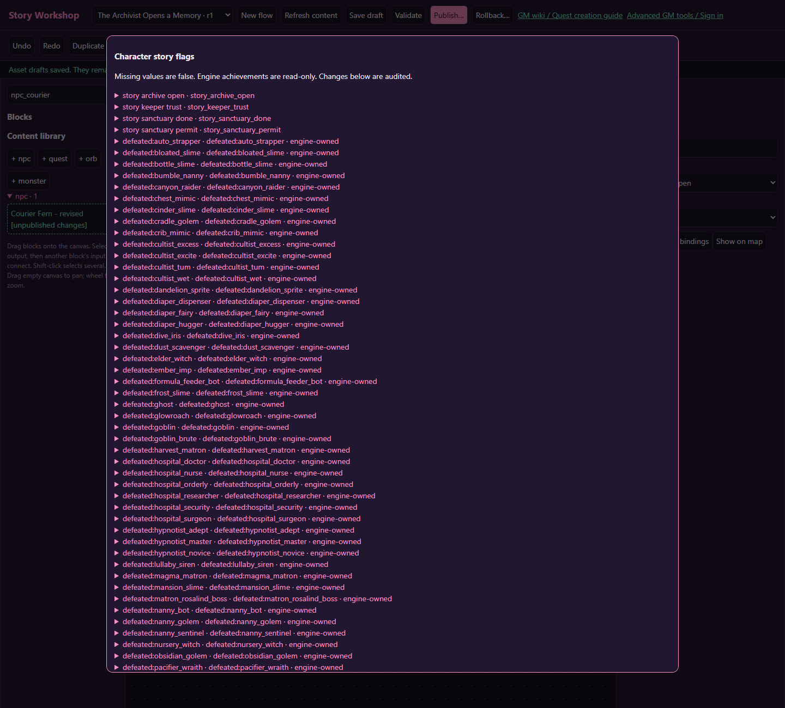

# Player story flags

[Wiki home](index.md)

**When flag is set** is an automatic story entry. Connect it to a scene or Battle. It fires once when the flag is first seen true and rearms after an observed clear/set transition. An already-set flag triggers on the first check. Choose **When objective completes** instead when you need one scene per accepted quest attempt without clearing a shared flag.

A story flag is a true-or-false fact about one online character. It survives travel, logout, reconnection, and server restarts. It is not account-wide and is not shared with the character's party.

## Define a flag

Open **Flag library**. Enter a stable ID beginning with `story_`, a readable name, and a description. For example:

| Field | Example |
| --- | --- |
| New flag ID | `story_scout_rescued` |
| Readable name | Rescued the scout |
| Description | Set after claiming the scout rescue; unlocks the grateful greeting and epilogue. |

Use lowercase letters, digits and underscores after the prefix. Treat the ID as permanent once content references it. The library's references list helps locate published checks and changes. Change the readable name or description when wording improves; do not rename the underlying ID casually.

A new definition does not create true values on characters. A missing value is false. You do not need to add Clear flag blocks at the start of every story.

Requirement forms include **Filter flags by name or ID**. Selected flags stay visible while filtering so a hidden search result cannot conceal an existing requirement.

## Set, clear, and check

**Set flag** writes true. **Clear flag** writes false. **Check flags** selects its `match` or `no_match` connection. These are committed server actions, so the client and generated AI dialogue cannot forge progression.

| Condition group | Passes when |
| --- | --- |
| All set | Every selected flag is true |
| Any set | At least one selected flag is true; an empty group adds no restriction |
| None set | Every selected flag is false or absent |

The groups combine: All set, Any set, and None set must each pass. Empty All and None groups also add no restriction. Thus an entirely empty condition matches everyone.

Example: “rescued the scout AND (found the map OR met the guide) AND has not collected the epilogue” uses All set for rescue, Any set for map/guide, and None set for epilogue. Selecting the same flag in both All and None creates a condition nobody can satisfy.

## Where to use conditions

- NPC story reactions select a greeting or bound flow entry.
- NPC dialogue actions and Player choice blocks restrict options.
- Quest eligibility, objectives and branches restrict quest behavior.
- Orb story conditions make a memory dormant until requirements pass.
- Entry-binding conditions restrict whether a flow starts.
- Check flags blocks select narrative routes.
- Wait for objective with Wait for `flag` pauses until its condition matches.

For different narrative scenes, route a Check flags output to separate Narrative blocks. A descriptive sentence saying “the player is trusted” has no gameplay effect until an authored condition or flag change implements it.

## Engine-owned achievements

The library also identifies server-recorded achievements, including recorded boss victories and existing progression flags. They can be checked, but ordinary story blocks cannot set or clear them. Authored flags must use the authored namespace and an active definition.

Do not invent a writable substitute with the same meaning and assume engine services will recognize it. Use your authored flag for your own story decision, and use the engine flag when checking an actual game achievement.

## Place flag changes at the right point

An individual quest objective can set flags directly: select it in the quest canvas and use **+ Set flag on completion**. Its attached **On completed → Set flag** action runs when that objective meets its requirements, without waiting for the stage or quest to finish. It runs once per accepted attempt, including passive timers and eligible party credit. Clearing the flag afterward does not rearm the same objective; a new repeat attempt can set it again. See [objective completion actions](quests.md#objective-completion-flags).

Put success flags on the confirmed victory or completion route. Put claimed-reward flags after a successful Claim operation when the flag means the request is completely resolved. Defeat and retreat should only change flags when that is part of the intended story.

Clearing a flag does not undo a reward, quest claim, completed flow, or orb read. Those systems keep their own receipts. For example, clearing `story_scout_rescued` cannot make a once-only quest claimable again. If you need a repeatable event, design both the quest repeat policy and the flow's repeat guard accordingly.

Avoid mutually contradictory memories unless you deliberately model them. For a two-way faction choice, set the chosen flag and clear the competing authored flag in a committed path, then test both prior states.

## Inspect or repair a real character

In Flag library, enter the character ID and choose **Inspect current values**. The returned list shows authored values for that character. Clicking a value sets or clears it; this is a real, audited change, not a preview switch.

Inspect again after a change or if the server reports that the character changed. Revision checks prevent you from overwriting newer progression. Use this tool for deliberate repairs and keep a note of the intended correction. Do not use a real character as a convenient preview state.

## Preview and isolated overrides

Player preview exposes simulated flags relevant to the flow. Toggle them to test branches. When creating an In-game test code, **Use current preview flags** copies those explicit values into the sandbox character only. Unspecified values come from the copied character.

Test false defaults, all relevant true values, overlapping reactions, and clearing an authored flag. Leave the test and verify that the real character has its original values. See [Testing](testing.md).
