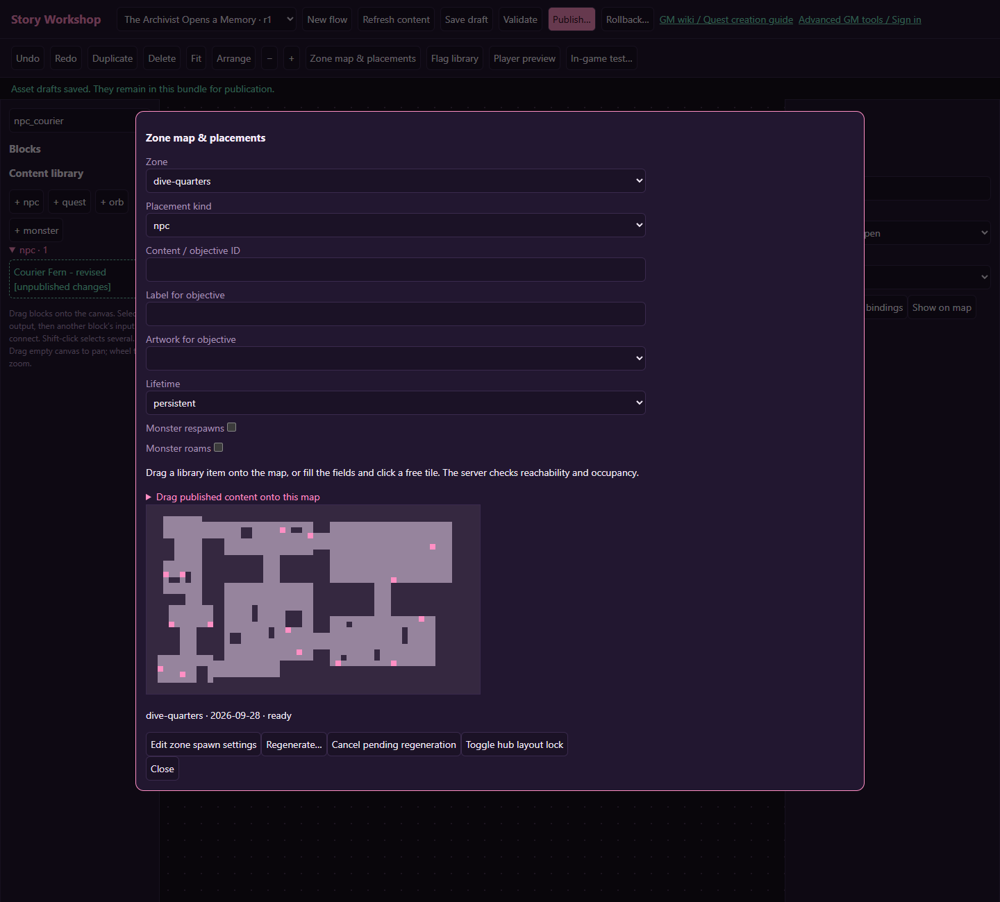
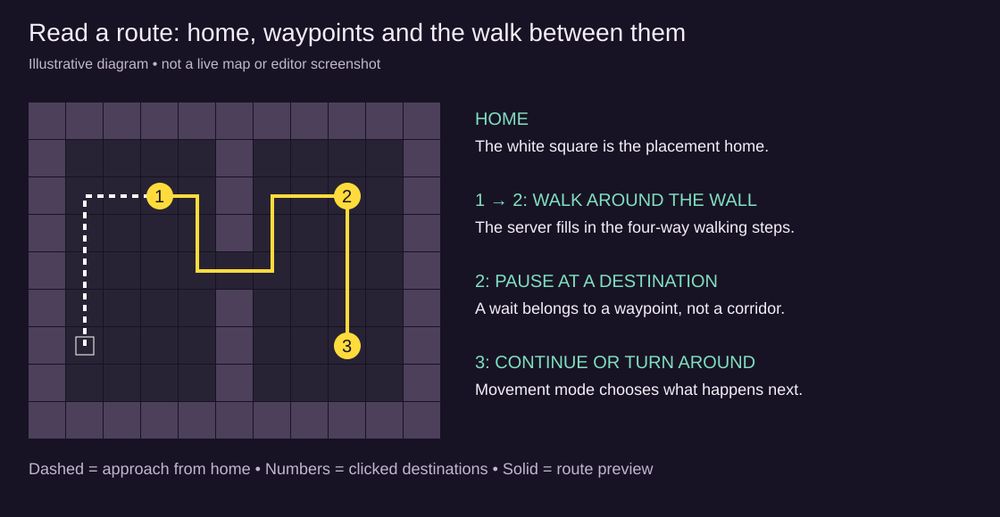

# Zones, placements and the Map Editor

[Wiki home](index.md)

Content becomes discoverable when it is placed in the world. Story Workshop uses the existing zone-map, placement and regeneration services. Terrain itself is edited in the **Map Editor** pop-out (below), which paints every zone with the game's real tile and scenery sprites and keeps GM edits in a per-zone patch layer.

## Open the map

Choose **Zone map & placements**, select an existing zone, and wait for its map. The dialog shows the map edition and current status. From a selected block, **Show on map** highlights matching content in the map view; choose the relevant zone if it is not the one already shown.

The map dialog contains its own **Drag published content onto this map** list. Use that list while the dialog is open; the main canvas library is behind the dialog. NPCs, orbs and monsters must be published and active to appear there.

## Place content

Drag a published item onto a free tile, or choose a placement kind and content ID in the fields, then click a tile. The server checks reachability and separation from entrances, fixtures, other placements and occupants. A visually empty tile is not always valid: nearby protected tiles or a disconnected pocket can still make it unsuitable.

Use positions near a recognizable landmark and leave the walking route clear. For NPCs and orbs, verify the character can stand on or beside the interaction rather than only seeing it across a wall.

| Kind | Content field | Use |
| --- | --- | --- |
| `npc` | Published NPC ID | Conversations and bound personal stories |
| `orb` | Published orb ID | Readable memories and bound orb stories |
| `monster` | Published monster ID | Ordinary placed encounter content |
| `token` | Matching quest target ID | Quest token collection |
| `interact` | Matching objective target ID | An interaction hotspot |
| `location` | Matching visit target ID | A location objective |

For objective placements, provide a useful label and optional artwork. The target ID is the link to the quest; two labels that happen to match are not enough.

## Lifetimes

**Persistent** placements survive new map editions. The system attempts to realize their logical position on a valid reachable tile when geometry changes; the exact tile may move. **Temporary** placements belong to the current edition and ordinarily expire when that edition is replaced.

Use persistent content for ongoing quests. Active quests can prevent removing or expiring required placements. When the server refuses a change, inspect the affected quests and provide a replacement or use the existing advanced removal workflow with its explicit failure decision. Do not repeatedly force regeneration to work around the check.

Monster placement has its own respawn and roaming controls. The **Monster respawns** and **Monster roams** fields describe placed monster behavior; they are different from the personal, nonrespawning enemy created by a flow Spawn monster block.

## Update or remove a placement

For a listed content placement, edit X, Y, and Lifetime, then choose **Update placement**. This preserves the placement's identity and content references. **Open content** returns to the shared record. **Remove** removes the placement, not the entire canonical NPC or orb.

Monster placement/removal uses the existing world tools; use the advanced Zones tools when a monster is not in the content-placement list. Do not expect deleting a flow block to remove a live map entity.

Map operations commit immediately and have edition/revision checks. If another GM edits the map, reload it before retrying. Canvas Undo only handles authoring edits; it does not undo an already committed world operation.

## Spawn settings and regeneration

**Edit zone spawn settings** opens the existing zone record when one is available. Depending on the zone, settings include spawning, enemies roaming, enemies per room, respawn intervals, pursuit steps, weighted enemy pools, and boss selection. Some controls apply only to the corresponding zone type.

**Regenerate…** requests the existing regeneration operation with its normal player and encounter safeguards. **Cancel pending regeneration** cancels an applicable outstanding job. **Toggle hub layout lock** applies to a supported generated hub district, not every dungeon or interior.

Regeneration is not a preview of your flow. It can replace live generated geometry after the service's safeguards permit it. Inspect players, ongoing quests and encounters before using it, and check persistent placements afterward.

## Placement acceptance checklist

1. The canonical record is published and not retired.
2. The target zone and current edition are correct.
3. The tile is reachable and leaves usable entrance and interaction space.
4. Quest target IDs match the placement content IDs exactly.
5. Lifetime matches the intended availability of the quest.
6. Two different characters can approach and interact without blocking each other.
7. Required content survives a supported regeneration or fails safely with a clear reason.

## Placed quest token visibility and pickup

GM-placed `token` objects appear in the game only for an active, incomplete `collect` objective with token enabled and a matching target ID. Any zone restriction and objective conditions must also match. Accept the quest first. Walk onto the token, click it while beside it, or press **E** beside it. Walking through it in a confirmed movement batch also collects it. A placement grants at most one token per accepted quest stage; clicking after walking cannot grant another. Collection hides that placement for the collecting character and leaves it available to other eligible characters. Abandoning or finishing the collection stage hides tokens that are no longer needed.

The GM map retains every authored placement. If it is visible there but absent in the game, check the accepted quest's current stage, exact target ID, token checkbox, conditions and zone. Published changes do not rewrite already accepted quest definitions; test a changed quest with a fresh eligible character or fresh isolated test state. For count greater than one, place distinct tokens with the same content ID.

## Map pictures

`GET /gm/map.png?zone=<id>&scale=32|16|8&layers=terrain,scenery,content,players,grid,safe` returns a PNG of any zone painted square by square with the game's atlases and scenery sprites, exactly as the client paints it (server `tile-painter.mjs` mirrors `scrTilePainter.gml`). The Zones tab has a **Download painted PNG** button and the Map Editor has one with a scale picker. Pictures are GM-only and are cached per zone revision.

`GET /gm/world.png?scale=8|4&layers=terrain,scenery,content,players` paints the whole world on one picture: every overworld, full dungeon and hub reachable from Honeydew, laid out by their exits. Zones joined by a wall gap on their edge sit on that side with the gaps lined up and a mint connector. Rooms, shops, caves and dungeons behind a door, warp pad or stairs sit in the nearest free space with a line back to their entrance (rose for doors, aqua for pads, gold for stairs). Instanced Dives are left out. The Zones tab and the Map Editor both have a **Download world PNG** button (8 px per tile, roughly 4300 x 3900 px). It is painted on a worker thread, so players never feel it. Repeat clicks within a minute reuse the last picture while nothing has changed.

What the picture approximates: themes the client paints from random pools (Dustbreak Desert, the Woods, the campaign dungeons, Princess' Quarters, generic hub halls) use a stable per-tile pick from the same pools, so they are close but not pixel-identical. Time-based effects are frozen: lava at frame 0, the Coast at low tide, the Gulch wash dry, the Caverns at ebb. The artwork ships in `server/tile-artwork.json`, exported from the game project with `python python/export_tile_artwork.py`; re-run it after adding or changing `sprTile*` atlases or scenery sprites.

## The Map Editor pop-out

**Pop out Map Editor** in the panel header (or **Open in Map Editor** on the Zones tab, or **Open the full Map Editor** in the Story Workshop map dialog) opens `/gm/map-editor`. It uses the grant stored by the panel, so sign in to Advanced GM tools first. Wheel zooms, right-drag or Space-drag pans, and the readout on the right names everything under the pointer (terrain, cover, scenery, fixtures, exits, monsters, placements, players, reachability).

Tools:

| Tool | What it does | Commits |
| --- | --- | --- |
| NPC routes | Select an NPC placement, draw waypoints, choose movement and schedule, and set waits | **Save routes**, separate from the terrain queue |
| Inspect / select | Read a tile; select a placement or DM monster to move, re-lifetime or remove it | immediately |
| Place content | The Zones-tab placer: monsters, NPCs, interaction objects, quest tokens, location objectives, story orbs, uploads, remove mode, orb scatter | immediately |
| Terrain brush | Wall, floor, prop and clear-prop brushes (1 to 5 tiles), Shift-drag rectangles; tiled hubs pick atlas cells for floor (left click) and wall (right click) | pending change |
| Scenery stamp | Any shipped sprite by name, footprint, solid and toilet flags; eraser removes scenery | pending change |
| Safe room | Drag a rectangle (Dives and overworlds); Alt-click removes one | pending change |
| Arrival spawn | Move the default arrival or a neighbour's arrival tile | pending change |
| Biome layers | Paint tall-grass cover and sheltered spots (Plains, Coast), the Gulch wash, the Coast shoreline per row, Pink Mist tiles, or move the Caldera crater (the heat zone follows) | pending change |
| Exits & pads | Slide a wall gate along its wall (the old opening closes, the arrival tile follows), move a warp pad to any walkable tile, or add a new gate or pad to a linked wilderness route, a hub, or a neighbour the map already reaches | pending change |

Pending changes preview on the canvas and queue on the right until **Apply**; Undo/Redo and Discard act on the queue. Full dungeons (`dungeon-*`) disable terrain-patch tools; Inspect, Place and NPC routes remain available for managed placements. The overlays toggle a grid, reachability (red = walkable but cut off from every arrival), safe rooms, biome layers and players.

## The patch layer: what persists and when it re-applies

Applied changes are stored per zone (`world_floor_patches`, with a history) and re-applied over every new edition: the weekly Dive floors, GM regenerations, rerolled or new monthly hub layouts, and the code-defined authored rooms (inns, halls, temples, the Farmstead, the Prospector's Camp). Each application records an undo log on the floor, so **Remove** (one stored change), **Roll back to** (an earlier revision) and **Clear patch** revert in place without regenerating.

Every change is validated against the live floor: the outer wall stays solid except at gates and exits; arrivals, exits, doors, chests, pickups and every fixture the patch did not add stay uncovered; the flood from the arrival tiles must still reach every exit, entry, chest, pickup and hub service (beds, shops, toilets, changers, cauldrons, altars, residents). A refused change names the tile and the reason and nothing is stored. When a later edition's layout forbids a stored change, that change is skipped for that edition and listed in the Patch layer panel.

Applying a change also moves DM monsters and visitors standing on a newly solid tile to the nearest open tile, re-realizes quest placements on the new geometry (active-quest conflicts refuse the change), and bumps the floor's geometry version so connected clients rebuild collision and the minimap. A player mid-battle on an affected tile blocks the change until the fight ends.

## Limits in this version

- A gate keeps its size and wall. A new crossing can only lead where the travel rules already allow (linked routes, hubs, existing neighbours); arrivals from the other side use your gate's inside tile, and the other zone's own exits are unchanged.
- Hub visitors see a GM reshape on their next snapshot (the room rebuilds in place with a log line); older clients built before 2026-10-03 repaint on re-entry.
- Supported gates and warp pads use Exits & pads; code-defined building doors are not draggable route waypoints.
- Full dungeons keep their generated layout, fixtures and puzzles.

## Map Editor acceptance checklist

1. The painted PNG of a zone matches what players see in that zone.
2. A painted wall collides in the game client after the next snapshot, and survives a Regenerate.
3. Clear patch returns the generated layout at once.
4. A refused change explains which tile or service it would strand.
5. Placements still have a walkable tile after terrain changes, and the quest guide still routes to them.

## Learn map editing and routes with pictures

Start with [Edit a map and verify the result](tutorial-map-editing.md) for a complete terrain/scenery exercise, a comparison of the three save workflows, and guidance for arrivals, biome layers and crossings.

Read [NPC routes and pathfinding](npc-routes.md) for the exact controls, waypoint limits, path colours, schedules and an interactive movement diagram. Follow [Build an NPC patrol](tutorial-npc-patrol.md) to draw a route around terrain, test waits and compare all movement modes. Then use [Daily work hours and timed rounds](tutorial-npc-schedules.md) for UTC windows, overnight schedules, route priority and interval delivery rounds.

Terrain previews and route previews are separate drafts. Apply required terrain changes first, inspect the result, then use Save routes. The route preview can draw through a pending opening that the live server has not received yet. Neither terrain Undo nor Clear patch restores a route draft.
