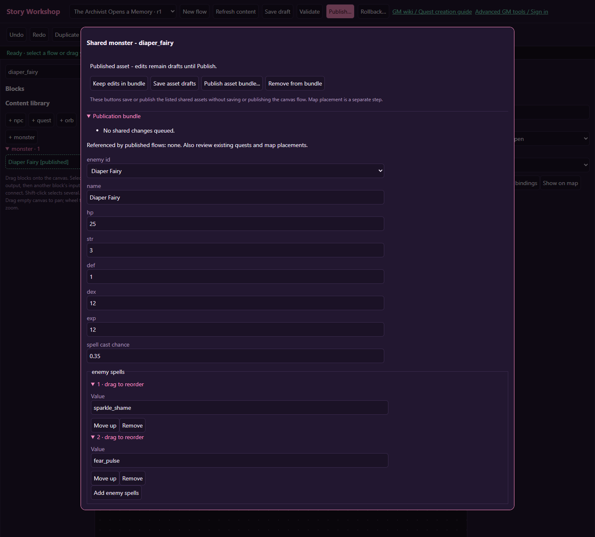
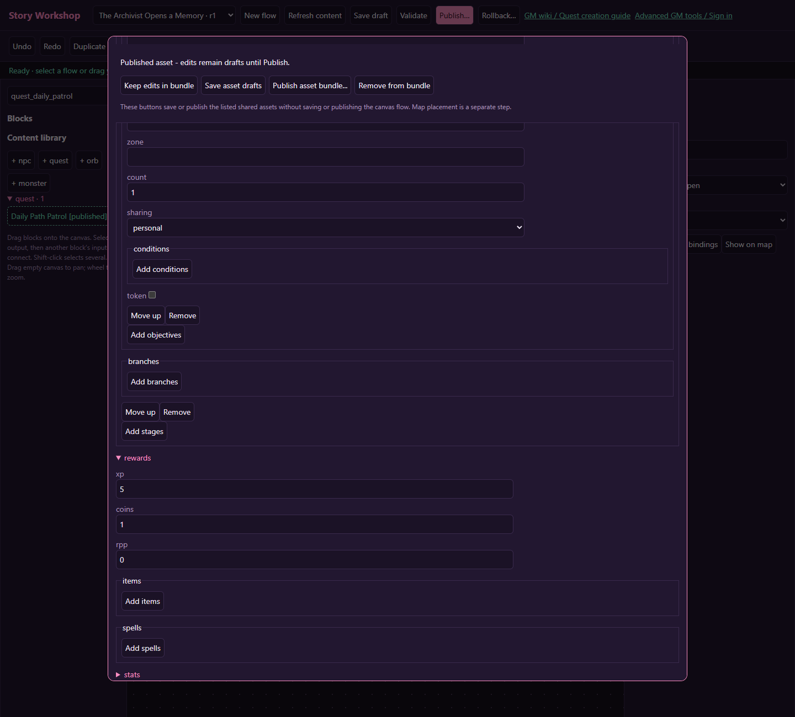

# Battles, rewards and effects

[Wiki home](index.md)

## Select or edit a monster

For a first story, reference an already published monster suitable for the area. Use **+ monster** only when you need a distinct enemy: it begins from an existing monster definition, so review every inherited setting before publishing.

Shared monster records can include identity, artwork, combat statistics, experience, actions and ability-related settings. Use the advanced monster editor for its specialized controls and review tools. Keep the record ID stable. Renaming the display name does not create a different quest target.

Check the whole combat package: HP, damage, defenses, resource use, abilities, rewards and defeat behavior. A low HP value does not make a powerful inherited ability harmless. Test with the intended player level and equipment, not only a GM using god mode.

Publishing a shared monster can affect other encounters that use that record. Active flow runs capture their referenced monster definitions, so a new publication does not retune an encounter already pinned to the old definition.

## Battle blocks and party behavior

A Battle block starts authoritative ordinary PvE with exactly 1-3 selected monsters. Drag onto an existing Battle to add a slot; empty canvas creates a new Battle. Duplicate types are allowed. Remove on the card, or replace/reorder in the inspector. A fourth slot is rejected. The lineup needs a reachable unoccupied tile near the owner for every foe, and victory waits for all of them. If the area is crowded or blocked, the server can reject the start; test the location where the player will actually trigger the interaction.

Connect all three outputs:

- **victory:** success and eligible completion operations.
- **defeat:** recovery or an authored failure continuation, after mandatory game defeat processing.
- **retreat:** a departure/interruption continuation that does not assume a win.

Eligible allies can join under existing rules. Players plus followers cannot exceed three participants, and a party may have at most one hired follower. The flow does not manufacture extra slots or override PvP/arena rules. Only the story owner advances their personal flow from the encounter outcome.

Each quest kill objective targets a monster content ID from the lineup. Set its count to match the intended number of that type. Its zone restriction must match where this battle occurs. If you accept the quest after the battle, that earlier victory is not a promised future objective event.

## Spawn versus fight

**Battle** starts the fight and waits for its outcome. **Spawn monster** creates an owner-specific story foe but immediately continues through `next`. It is nonroaming and nonrespawning; use normal map monster placement for a shared recurring population.

For an encounter the player can approach later, accept the quest, spawn the monster, and wait for the quest to become ready. Explain where the player should go. Test leaving, returning, and approaching the enemy with another character so the personal ownership is clear.

## Budget all reward sources

| Source | Typical purpose | Duplication risk |
| --- | --- | --- |
| Normal combat rewards | Winning the encounter | These may already include XP or loot. |
| Quest claim | Completing the tracked request | Claim through the quest service, not a matching hand-written payout. |
| Flow Reward | A separate authored story award | A repeatable flow can reach this again in a new run. |
| Character effect `give_item` | A specific story item handoff | This is an additional item even if a quest reward grants the same item. |

Write down the intended total before entering values. If the quest pays 10 XP and a Reward block also pays 10 XP, that is 20 authored XP in addition to any monster XP. Use one reward owner for each intended payout.

Flow rewards support XP, coins, RPP and item/count rows. A single field accepts bounded nonnegative values; the validator rejects out-of-range numbers and unknown items. Coins use the game's account reward cap. The actual paid coins can therefore be lower than the authored amount. RPP and inventory capacity also retain their existing limits.

Execution receipts prevent a retried committed command from paying twice. They do not mean “once forever” for a repeatable story. Gate one-time rewards with an authored completion flag or use a once-only quest claim. Set the flag in the same success path.

## Character effects

Choose **Character effect**, add a row, select the type, and provide the relevant amount or item.

| Type | Behavior |
| --- | --- |
| `heal` | Adds HP up to the existing maximum |
| `damage` | Reduces HP with the existing story-effect minimum; it does not itself run battle defeat settlement |
| `wet`, `tum` | Changes the corresponding need using existing clamps and supported character settings |
| `shame_delta` | Signed adjustment through the existing dignity/shame rules; check the resulting meter in a test |
| `stamina_drain` | Reduces stamina |
| `excitement_down` | Reduces excitement |
| `inco_down` | Reduces incontinence |
| `give_item` | Grants the referenced item through normal inventory handling |
| `force_equip_item` | Applies the supported forced equipment change |
| `replace_diaper` | Uses the existing replacement behavior for the selected item |

For directional effects, use a positive amount to mean the named direction. Do not use a negative heal as an obscure substitute for damage. Item effects require an existing item ID. The effect selector is a whitelist: arbitrary scripts, commands, engine-flag writes, or moderation operations are not available.

Explain consequential effects in the scene. Preview does not apply these effects to a real character; verify their actual clamps, inventory handling, and equipment consequences in an isolated in-game session.

## Failure and reward checks

Test victory, defeat and retreat; reconnect while the encounter is outstanding; repeat a continuation; fill inventory before a claim; reach the coin cap; and revisit after success. A stalled reward should leave a clear recovery path, such as freeing inventory and trying again, rather than asking the player to repeat an already-won battle.
