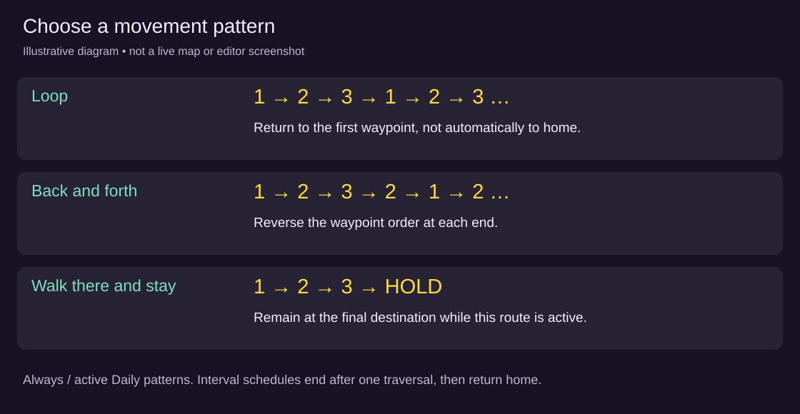

# NPC routes and pathfinding

[Wiki home](index.md)

Use **NPC routes** in the Map Editor to give a placed NPC a patrol, a daily workplace, or an occasional delivery round. You choose destinations and waiting times; the server finds the walk between them. Start with [your first patrol](tutorial-npc-patrol.md), then try [daily and interval schedules](tutorial-npc-schedules.md).

## What owns the route

A route belongs to one **NPC placement in one zone**, not to its shared NPC definition. Two placements of the same character can have different patrols. Select an NPC listed among the map's content placements; this tool does not assign routes to arbitrary engine residents, monsters or players. Routes do not cross zone exits.

Publish the NPC definition and place it first. Its placement supplies **home**, shown as a small white square. Route waypoints are destinations, not a new home position. A routed placement follows its schedule instead of the definition's random wandering; a wander radius is not required. Delete all routes and save to return to the definition's ordinary stationary/wandering behavior.

## Open and draw a route

1. Open **Pop out Map Editor**, choose the zone and select **NPC routes** in the tool palette.
2. Click the placed NPC at its current tile or home tile. Its name and route controls appear on the left.
3. Choose **+ route**, or click the first destination tile to start the first route automatically. Give it a useful **Name**.
4. Click reachable floor tiles in travel order. Numbered circles show the waypoint order. You do not need to click every tile in the corridor.
5. Set **Movement**, **When**, and each waypoint's **wait** in seconds.
6. Choose **Save routes**. The change is live immediately and the NPC restarts from home. Keep a player in the zone to observe movement; the Map Editor alone does not count as a player.

Alt-click a waypoint, or use its **×** button, to remove it. **Delete this route** removes the selected route from the draft; save to commit. There is no drag-to-reorder control: remove/re-add waypoints or rebuild the route in the intended order. Route tabs select which route you are editing, not its priority. To change route priority, recreate routes in the desired order.

**Discard changes** reloads the saved routes. Once clean, that button becomes **Choose another NPC**. Save or discard before selecting a different NPC. Terrain queue Undo/Redo does not undo route edits. A map edition change requires refreshing and checking the route against the new layout; an ordinary NPC step during editing does not itself invalidate a route save.

## Read the map and path previews

| Mark | Meaning |
| --- | --- |
| White square | Placement home |
| Numbered coloured circles | Destination order within a route |
| Dashed first segment | Approach from home to waypoint 1 |
| Solid coloured segments | Preview of travel between waypoints |
| Red/pink straight connection | No walkable preview path between those stops; inspect the obstruction |
| Dimmed route | Another route is selected for editing |

The **NPC routes** overlay shows saved routes; choosing the tool also displays routes while editing. The **reachability** overlay is different: red tiles there are walkable floor disconnected from all arrival tiles. A destination must be on reachable floor and clear of protected entrances, exits, fixtures, chests and pickups. A tile that accepts a preview click can still be refused by the server's more complete placement checks.

The preview uses the shortest four-direction walk through the current geometry, including pending terrain edits. It does not predict moving monsters or other temporary occupants. The server recalculates movement around current blockers; a blocked NPC waits and tries again. If you need an NPC to pass through a particular doorway, add a waypoint near that doorway rather than assuming the shortest route will visit it.

## Movement modes

| Movement | Behavior while an Always or Daily route is active |
| --- | --- |
| Loop (last waypoint back to the first) | Home → 1 → 2 → 3 → 1 → 2… |
| Back and forth | Home → 1 → 2 → 3 → 2 → 1 → 2… |
| Walk there and stay | Home → 1 → 2 → 3, then remain at 3 |

A one-waypoint route is a post to stand at, whichever movement mode you choose. Waiting applies at each reached waypoint before continuing. A final wait completes before an interval route counts its traversal as done. Movement normally advances by at most one tile per two-second server slot; this tool does not set walking speed.

## Schedules and priority

| When | Meaning |
| --- | --- |
| Always | Eligible continuously; put this fallback after narrower schedules |
| Daily, between two times | Active from **From (UTC)** inclusive until **Until (UTC)** exclusive; an end earlier than the start crosses midnight |
| One lap every N minutes | Eligible once per server-time period; after finishing, return home and allow a lower-priority matching route on a later tick |

Routes are tried in displayed order. The **first matching route wins**; selecting another tab does not promote it. An Always route first prevents later routes from running. A daily window can interrupt a lower-priority route; when the selected route changes, it begins at that route's first waypoint from the NPC's current position. When none match, the NPC walks home. Start and end times cannot be equal; use Always for all day.

Interval periods use fixed server-time boundaries, not a countdown started by clicking Save. For example, a 30-minute interval becomes eligible in each `:00–:29` and `:30–:59` period. It can start partway through a period if not yet completed. A long traversal may span a boundary; this is not a precise appointment timer. For interval Loop/Walk there and stay, finishing the last waypoint completes the traversal and the NPC heads home. Interval Back and forth completes when it returns to waypoint 1. The editor's loop-closing preview is geometric; it does not override this interval completion rule.

## Try the movement demonstration

The interactive diagram below is a **local teaching model**, not a live map. Choose a movement mode, press **Step** or **Play**, and watch the numbered destinations. Toggle **Route active** off to demonstrate returning home; toggle **Block the passage** to see a failed path. **Reset** starts at home. Waypoint 2 waits four seconds. The diagram models Always/active Daily movement, not interval scheduling, conversations or empty-zone catch-up. Use the [schedule tutorial](tutorial-npc-schedules.md) for those cases.

If scripting is unavailable, the movement picture and table above show the same sequences.

## What happens while players are away

Routed NPCs walk only while the zone has a recently active player. After more than a minute without being observed, returning players can see the NPC resume at a schedule-appropriate stop: the last waypoint for Walk there and stay, otherwise the first, or home when no route matches. They do not watch every missed step replay.

A conversation pauses the NPC. While moving, a routed NPC allows players to pass through; when waiting or standing, it resumes ordinary placement occupancy. Monsters and stationary placements can still block its path. Movement changes facing; a stationary definition with no routes and no wander radius uses its default facing.

## Limits and map changes

Each placement supports **four routes**, each with **1–16 waypoints** and a name up to **60 characters**. Waits are **0–600 seconds**. Interval periods are **1–1440 minutes**. Use separate persistent placements for long-lived patrols; temporary placements retain their normal map-edition lifetime.

After a patch or regeneration, the server tries to move invalid waypoints to a usable tile within three tiles of Manhattan distance. It drops points that cannot fit and omits routes left with no points in that realized layout. The editor reports dropped waypoints. Review shifted points too: a snapped destination may no longer represent the intended shop or doorway. Saving the displayed routes keeps that adjusted version. Keep a written copy of important routes before replacing a layout.

Route saves use **Save routes** and terrain edits use **Apply changes**. Apply and verify geometry before saving routes that rely on it. Patch rollback/clear does not restore an earlier route draft, and deleting a flow block does not remove a patrol.

## Troubleshooting

| Symptom | Check |
| --- | --- |
| Clicking an NPC does nothing useful | Select NPC routes and a managed NPC placement, not a baked-in engine fixture |
| Save rejects a waypoint | Check walls, props, protected objects and arrival reachability; pending terrain is not live yet |
| Second route never starts | Look for an earlier Always route or an overlapping daily window |
| NPC stays put in the editor | Put a player in the zone; check waits, conversation holds, schedule and blockers |
| NPC stops on the final point | Walk there and stay is working; a single-point route also stays at its post |
| NPC heads home after one traversal | That is expected for an interval route or when no schedule matches |
| A route changed after regeneration | Inspect shifted/dropped destinations before saving again |
| The line differs from the live walk | The preview covers geometry; live occupants can change the available path |
