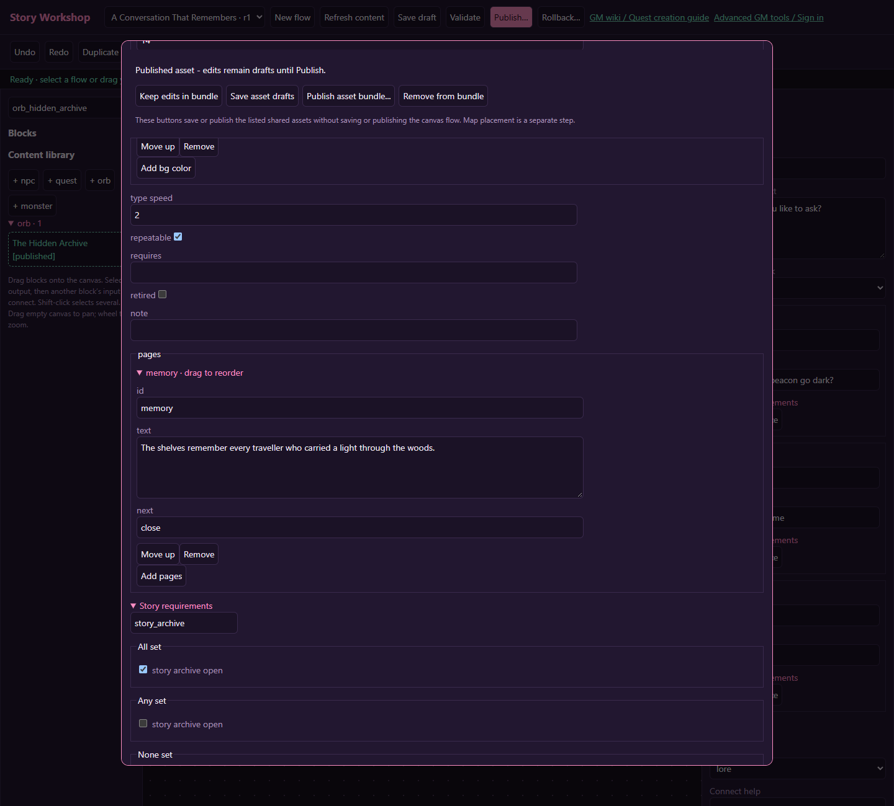

# Orbs, narratives and artwork

## Visibility from story blocks

Enable **Hidden until revealed** in the orb Settings and place it on the map. Connect **Reveal orb** after a cutscene or trigger, select this orb (or drag it onto the action), and connect `next`. Use **Hide orb** later to conceal it again. Visibility is saved per character and orb ID, covering every placement of that orb. The default keeps existing orbs visible. Reading prerequisites still apply after reveal; a spent one-time orb stays spent.

[Wiki home](index.md)

Use an orb for a discoverable memory in the world. Use a Narrative block for an illustrated or text-based scene in a playable flow. They can share subject matter while retaining different authoring responsibilities.

Work through [Unlock a secret memory orb](tutorial-secret-orb.md) to connect an NPC decision to personal reading access.

## Create an orb

Click **+ orb** or open the advanced orb editor. Keep its stable ID, enter a title, select a glow color, and write at least one nonempty page. Save the record and reopen it if you need the normalized optional fields.

| Field | Meaning |
| --- | --- |
| title | Player-visible story title |
| colour | Glow color, stored as `#rrggbb` |
| bg color | Three red/green/blue values from 0 to 255 |
| type speed | Presentation speed setting, from 1 to 10 |
| repeatable | Whether that character may read it again |
| requires | Another orb ID that must have been read first; empty means none |
| story conditions | Current flag requirements |
| pages | Text and optional supported presentation for the orb reader |
| note | Authoring note, useful for placement intent |

The canonical prerequisite field for an earlier orb is **requires**. Do not rely on an extra, unrecognized field in an unsaved draft to create a chain. Save/reopen or use the advanced orb editor to select the canonical setting.

Publish prerequisite orbs before dependent ones. An orb cannot require itself. Review chains in player order, and make sure the first orb is discoverable.

## Place and read it

Publish the orb, open **Zone map & placements**, select the zone, and drag the orb from the map dialog's published-content list onto a reachable free tile. A character must stand on or beside it to read it.

An unread orb with unmet requirements is dormant. A nonrepeatable orb already read by that character is spent and no longer appears for them. Flags and read history are personal, so two nearby players may see different orb availability.

Clearing a flag does not erase an orb read. To test a once-only orb repeatedly, use fresh isolated sessions from an appropriate character or another character with no read receipt.

## Bind an orb to a flow

Add an `orb` entry binding to a flow, choose the orb record, and choose the first block. Normal distance, availability and prerequisite checks still run before the flow starts. When the binding starts a flow, the player gets the flow's presentation instead of two overlapping readers.

Keep the orb's original pages coherent as fallback content. The orb and flow each have their own repeat setting and completion history. A repeatable orb attached to a completed nonrepeatable flow is not a reliable way to replay the flow. For a single epilogue, use a nonrepeatable orb and a dedicated nonrepeatable epilogue flow.

An orb read records its read event when the read starts, not only when the final flow page ends. Do not use “has read this orb” as proof the player won a battle later in its flow. Set a separate completion flag on the confirmed success path.

## Seed existing pages

Open an NPC or orb asset and choose **Seed a new draft flow from this content**. Review the replacement prompt: this replaces the current unsaved graph with a new draft, while preserving the original canonical content.

Imported pages and ordinary choices become connected blocks. Review artwork, destinations and any imported quest operations. Save, validate, and test before publishing the explicit binding. The imported flow is not automatically resynchronized whenever the source pages change.

## Artwork

For a flow page, select **Portrait / artwork** in the right pane. For NPCs, use sprite and battle sprite as appropriate. Choose from compiled sprites or uploaded/approved assets already present in the catalog.

Use the advanced artwork tools when you need to upload, generate, review, approve or assign new art. An artwork job or draft image is not automatically a published asset. Finish that workflow, then reload the workshop's catalog and select the available asset.

Test text over the actual artwork on a small screen. Keep important faces and objects away from the dialogue text area. Check long paragraphs, empty artwork, and a temporarily unavailable image; the story instructions should still be understandable.

Do not put behavior into image filenames or narrative prose. A picture of a reward does not add an item; a page saying “your wounds heal” needs the corresponding Character effect if actual healing is intended.

## Illustrated page controls

Use exact page IDs for destinations and close for the final page. The [secret-orb tutorial](tutorial-secret-orb.md) shows the separate personal access requirement.
