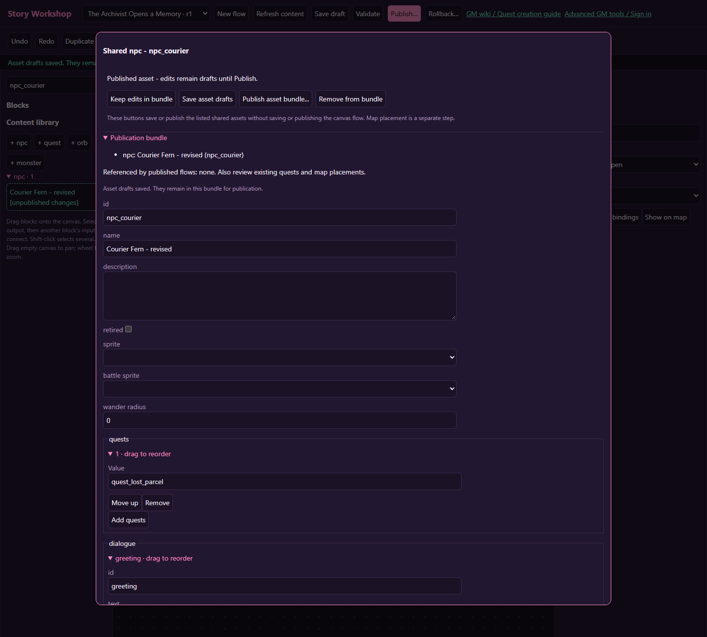

# Save, publish and rollback

[Wiki home](index.md)

## Save draft

**Save draft** stores the current flow and its bundled shared-asset edits together. A successful save advances revisions and clears that tab's unsaved recovery entry. It does not activate the new flow in the world.

Flag definition changes and map operations have their own saves/actions. Do not assume they are held until the next flow save. Keep those operations in your release notes alongside the flow.

## Publish an NPC or quest without a flow

Open the shared record from the library to show its content blocks. The top toolbar offers **Save content drafts**, **Check blocks**, and **Publish content**. Save/publication act on the listed shared assets and their required unpublished dependencies, independently of the surrounding story flow. A blank story flow is allowed. **Back to story flow** retains the content bundle. Use this for ordinary journal quests and NPC dialogue that do not need a personal story. Other asset types retain their specialized forms.

Review the names under **Shared publication bundle** and the final confirmation. Related NPCs and quests can be published together even when they reference one another. Other already-published assets keep their live versions unless you explicitly include edits. Opening an unchanged published asset alone does not republish it.

Block checks highlight affected cards; server validation and revision-conflict errors appear in the status and inspector. Failed publication is atomic. Save does not make an asset available to players; sidebar labels distinguish **[draft]**, **[published]** and **[unpublished changes]**. New NPCs still need a map placement after publication.

When saving the flow first, its explicit shared edits remain in the tab's bundle with their new revisions. Publishing afterward includes them. Reload recovery restores that bundle; deliberately switching to another flow starts a different bundle. Reopen saved assets marked unpublished changes if you need to include them in a new tab. Refresh content does not overwrite local edits or bypass revision conflicts.

## Validate the complete story

Choose **Validate** and resolve errors. The server checks references, flag permissions, supported operations, destinations, required outputs and executable structure. Existing quest validators continue to reject invalid stages, unknown objective references and quest cycles.

Warnings about unreachable blocks deserve review. A graph with no errors can still be badly designed: a wait might have no practical completion path, two reward sources might duplicate a payout, or refusal might consume a nonrepeatable story. Use [testing](testing.md) to catch those design problems.

## Review shared dependencies

An asset opened for editing belongs to the canonical library. Publishing it can change other NPC encounters, quests, or flows that reference the same ID. Review the referenced-flow information in the asset dialog, the publication summary, and flag-library references when changing story conditions.

Do not interpret “no affected flows” as “no player can be affected.” An NPC may be placed in the world, a monster may be in a zone pool, or an accepted quest may have captured the record. Inspect those uses in the relevant advanced editor or map too.

If an existing published asset must remain unchanged for its other uses, create a deliberately separate record and update the intended references. A new record needs its own publication and placements; changing a label alone does not fork an asset.

## Publish

Choose **Publish**, read the confirmation, and review the flow and shared assets in the bundle. Referenced unpublished drafts and their unpublished prerequisites appear in the included-assets confirmation and are published with the flow. Existing published assets keep their live definitions unless explicitly edited in the bundle. Related edits commit atomically: an invalid bundle does not partially publish the NPC while leaving the flow invalid.

Entry bindings make the flow discoverable through the selected NPC, orb, zone or quest-completion trigger. A single trigger cannot belong to two different active published flows. Move alternatives into one branching flow, or retire/rebind the old owner deliberately.

Save or publish through one editor at a time. Revision conflicts mean someone or another window saved a newer version. Preserve your unsaved text, reload the latest record, compare it, and apply the intended change. Do not delete and recreate a record to bypass a conflict.

## What existing players see

Active flow runs pin their published flow and referenced quest/monster definitions. Accepted quests and started encounters keep their captured definitions. New publication affects subsequent runs and newly captured content, not a story already underway.

Character flag values stay current. An already-open choice can therefore become unavailable if its requirements change, and an NPC personal-story offer can become stale if the selected entry or publication changed. The player should close and reopen that interaction.

This means a tester already in an old run is not a reliable check of your newly published text. Use a fresh appropriate character or isolated test to review the new draft, and explicitly verify a new live run when testing publication.

## Rollback

Choose **Rollback…** and enter the historical published flow revision to restore. The restored definition becomes a new publication for subsequent runs. It does not rewind character flags, refund currency, remove already granted items, or reset quest claims.

A flow rollback is not a blanket rollback of all canonical asset publications. If an NPC or monster also needs restoration, review that asset's history and restore it through its existing editor, then validate the flow/dependencies again. Current reference checks can reject an old flow if its dependencies are no longer valid.

## Retirement and replacement

Use the canonical retirement controls when removing a shared asset from future use. References and dependent content may block retirement. Update or retire those references first instead of leaving a dangling entry point.

For an event ending on a live server, plan what happens to accepted quests, placed objectives, current encounters, and in-progress stories. Removing a map target does not complete the quests that needed it.

## Rollout switch

`QUEST_FLOWS_ENABLED` controls flow publication/start rollout and defaults to false. The workshop can still support draft work and preview while publication is disabled. The server operator should deploy additive server support and the wiki, then compatible game clients, and enable the switch after the release checks pass.

`LIDOLLQUEST_GM_PUBLIC_URL` configures the in-game GM launcher and should point at the approved public GM URL ending in `/gm`. GMs author content through the panel; changing deployment settings remains an operator task.

Keep an ordinary browser link available when pop-ups are blocked. A compatible client is required to start a flow interaction; do not advertise a live story to old clients that cannot present it.
