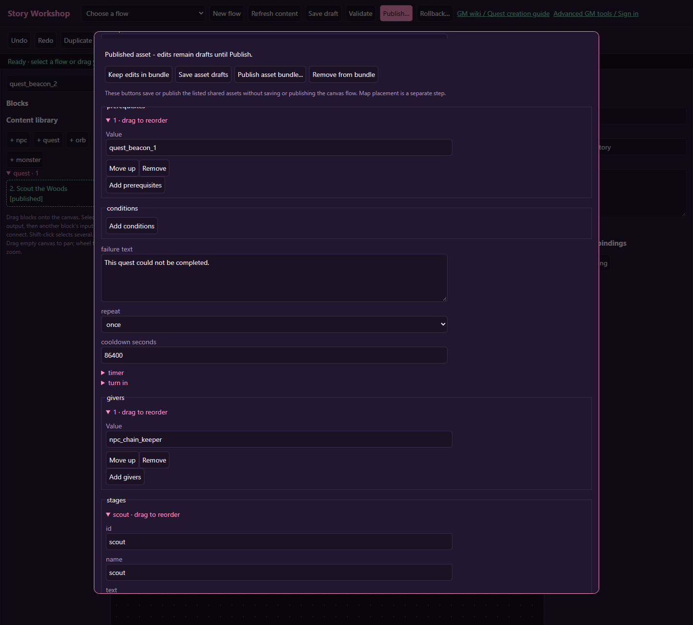
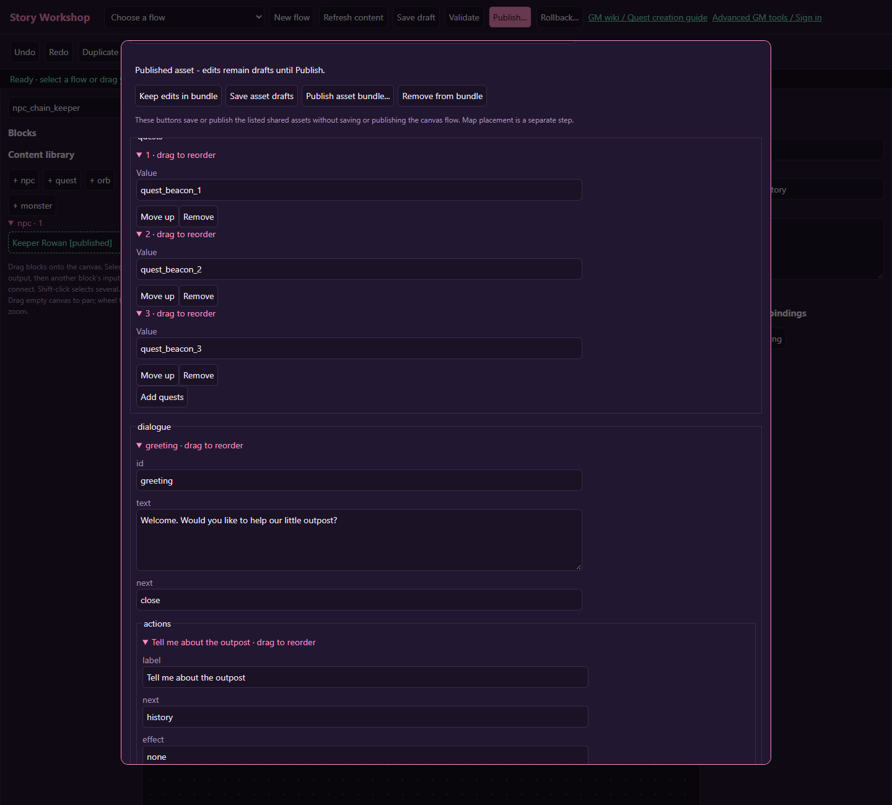

# A three-quest chain: relight the beacon

> **Content block controls:** Quest stages, objectives, NPC pages/choices and orb pages now open as blocks with a small inspector. Keep generated stable IDs; connect destinations using the canvas or its selectors. Use **Save content drafts**, **Publish content**, and **Back to story flow**. Older images below show the previous forms; use the [current workspace controls](workshop.md#shared-content-uses-blocks-too) for those steps.

[Wiki home](index.md) · [Quest reference](quests.md)

Build three separate journal quests that unlock in order. The player meets Keeper Rowan, scouts the Haunted Woods, then returns with a report. Each quest has its own acceptance and reward claim. This teaches **prerequisites**, which require a claimed reward rather than merely a finished objective.

## Before you start

Open Story Workshop and use **+ npc** and **+ quest** in the content library. This example does not need a canvas flow: the NPC's ordinary quest menu handles acceptance, progress and turn-in. Use **Save content drafts** and **Publish content** inside the shared-content form.

The pictures use memorable demonstration IDs. Your editor generates different IDs: keep them, copy them from the ID field, and substitute them everywhere this guide names a quest or NPC ID. Stage and objective IDs can be edited. Save frequently, and use **Refresh content** when another window saves a record.

## 1. Create Keeper Rowan

Give the NPC a stationary placement (`wander radius` 0), a greeting page and a readable name. Example greeting: “The beacon needs three small acts of kindness. Ask me about the first one.” Leave the page's next destination `close`. Save the NPC draft so its ID is available to the quest forms.

## 2. Make the three quest records

For each quest, set repeat to `once`, timer seconds to `0`, turn-in mode to `journal`, and add Rowan's actual ID under **givers**. Expand **stages**, add one stage, and add an objective inside it. Set stage mode `all` and next `complete`.

| Quest name | Stage ID | Objective type | Target | Count | Reward XP |
| --- | --- | --- | --- | --- | --- |
| 1. Meet the Keeper | `meet` | `talk` | Rowan's NPC ID | 1 | 10 |
| 2. Scout the Woods | `scout` | `visit` | `overworld-haunted-woods` | 1 | 10 |
| 3. Report to the Keeper | `report` | `talk` | Rowan's NPC ID | 1 | 30 |

Write explicit journal instructions. Quest 1 should say “Accept this request, then speak to Rowan again.” The conversation that preceded acceptance does not satisfy the new talk objective. Quest 2 should tell the player to reach the Haunted Woods, and quest 3 to return and speak to Rowan.

## 3. Link the prerequisites

Leave quest 1's **prerequisites** empty. In quest 2, click **Add prerequisites** and enter quest 1's actual ID in Value. In quest 3, add quest 2's ID. Do not enter a flow ID, quest title, or stage ID.

The chain is **claim quest 1 → offer quest 2 → claim quest 2 → offer quest 3**. Reaching `complete` only makes a quest ready; the player must claim it. Never make quest 1 require quest 3: prerequisite cycles are rejected.

## 4. Link all three to the NPC

Reopen Rowan from the library. Under **quests**, add the three actual quest IDs. The giver references already connect the quests to Rowan; this list makes the NPC's authored links explicit. Keep the ordinary quest menu available rather than replacing it with hard-coded dialogue that always offers all three.

## 5. Publish and place

Save the three drafts, then open Rowan and review **Publication bundle**. His unpublished quest references are included automatically. Choose **Publish content** and check every listed name. This validates the mutually referenced NPC and quests together; you do not need to publish one broken half first.

Open **Zone map & placements**. Select the intended existing zone, choose kind `npc`, use Rowan's ID as Content, and place him on a reachable free tile. Publishing does not place an NPC automatically. See [Maps](maps.md) for lifetime and placement checks.

## 6. Verify the whole chain

| Test | Expected result |
| --- | --- |
| Fresh character talks to Rowan | Only quest 1 is eligible |
| Accept quest 1, then talk again | Quest 1 becomes ready |
| Leave quest 1 ready but unclaimed | Quest 2 stays unavailable |
| Claim quest 1 and reopen conversation | Quest 2 appears |
| Accept quest 2 and travel to the Woods | Quest 2 becomes ready |
| Claim quest 2, accept quest 3, return to Rowan | Quest 3 becomes ready |
| Claim all three and revisit | None offers a duplicate once-only reward |

Use an appropriate test character for live entry checks. GM force-start tools bypass eligibility and cannot prove prerequisites work. Preview alone cannot test journal claims. If adding a flow later, remember that one NPC binding can belong to one published flow: branch within that flow rather than binding three competing ones.
