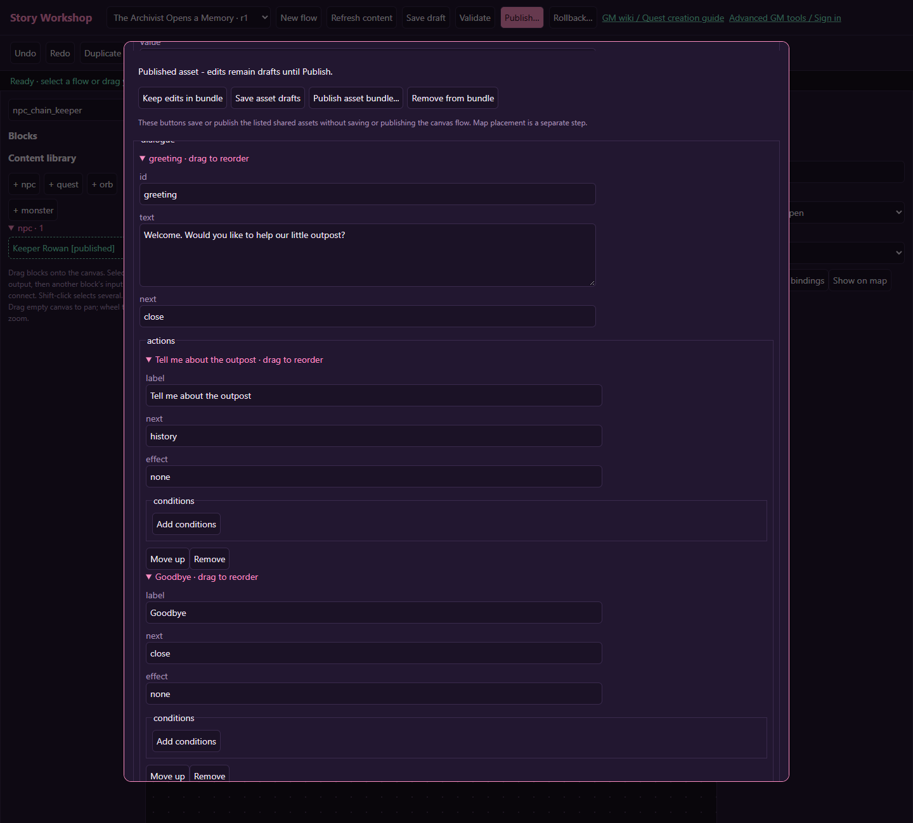
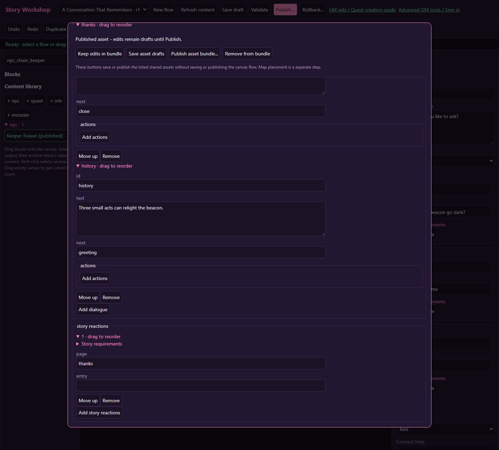

# Advanced conversations that remember the player

[Wiki home](index.md) · [NPC reference](npcs.md)

Write a conversation with an optional lore topic, a meaningful decision, and a different greeting on later visits. This tutorial has no journal quest or reward: it concentrates on **choice ports**, **persistent flags**, and **ordered NPC reactions**.

## 1. Prepare Rowan's ordinary dialogue

Create or open Keeper Rowan. Add pages `greeting`, `history`, and `thanks`. Set **story default** to `greeting`. Write a short introduction, a paragraph of outpost history, and a warm return greeting.

On the greeting page, add an action labeled “Tell me about the outpost,” effect `none`, next `history`. Give history next `greeting` so the player can return to the menu. Add a goodbye action with next `close`. Page IDs must match exactly; changing the display text does not change the destination.

Save the NPC draft. If it already offers quests, preserve those links and actions. The personal-story offer will coexist with its quest services.

## 2. Define remembered trust

Create `story_keeper_trust` in **Flag library**, with a readable name and a description explaining which decision grants it. Its initial value is false for each character.

Create a New flow called “A Conversation That Remembers,” enable **Repeatable**, and bind its Entry to Rowan. Repeatable lets players ask about lore again and revisit after choosing goodbye. It does not make flag writes into rewards.

## 3. Build a real conversation loop

| Block | Settings | Connections |
| --- | --- | --- |
| Entry | Start conversation | next → Known visitor? |
| Known visitor? | Check flags, All set `story_keeper_trust` | match → Welcome back; no_match → Topics |
| Welcome back | Dialogue recognizing the player | next → Topics |
| Topics | Player choice with lore, trust and leave choices | each choice gets its own destination |
| Lore | Dialogue about the beacon | next → Topics |
| Trust | Set flag `story_keeper_trust` | next → End |
| End | End interaction | no outgoing connection |

Use choice IDs `lore`, `help`, and `leave`; labels can be “How did the beacon go dark?”, “You can trust me,” and “Goodbye.” Connect the corresponding outputs to Lore, Trust and End. The lore loop is safe because the player must advance a dialogue page and make a choice. A loop consisting only of automatic flag or condition blocks is invalid.

## 4. Make the NPC greeting react too

In Rowan's **story reactions**, add a rule with All set `story_keeper_trust`, page `thanks`, and entry blank. A page selects ordinary greeting dialogue; an entry selects a node in the NPC's bound flow. Do not confuse page IDs with block IDs.

Rules are tested from top to bottom and the **first match wins**. Put narrow rules first. For example, a rule requiring both trust and a later rescue flag belongs above a trust-only rule. Drag a rule by its summary or use **Move up**. Keep an explicit default for characters who match none. Preserve mandatory engine reactions on existing special NPCs.

## 5. Add a conditional topic

As an optional extension, add a choice called “What else do you know?” and require `story_keeper_trust` under that choice's All set conditions. Connect it to a new lore page and back to Topics. Requirements control whether a choice is usable; they do not set flags. Revalidation can reject a choice if requirements change while it is open.

## 6. Publish and test revisits

Save the NPC changes with the flow, Validate, and Publish the reviewed bundle. Place Rowan if he is new. Ordinary greeting changes are seen when a fresh interaction starts; an already-open conversation keeps its captured pages.

Test a fresh character, repeated lore visits, goodbye without trust, granting trust, closing/reopening, and a second character with no trust. In preview, flip the trust flag and restart to test the entry check. In the isolated game test, verify persistence within that test; stopping it must leave the real character's flags unchanged.

Do not use automatic AI chat as the authority for a promise or reward. Authored choices and committed flow actions own these flags.
