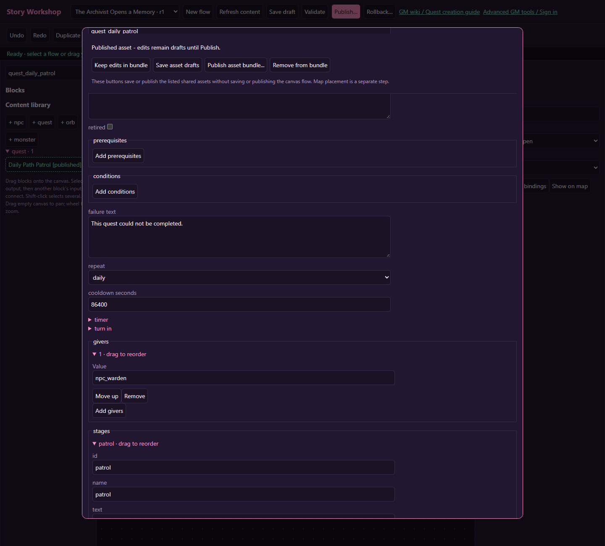

# Bonus tutorial: a repeatable daily patrol

> **Content block controls:** Quest stages, objectives, NPC pages/choices and orb pages now open as blocks with a small inspector. Keep generated stable IDs; connect destinations using the canvas or its selectors. Use **Save content drafts**, **Publish content**, and **Back to story flow**. Older images below show the previous forms; use the [current workspace controls](workshop.md#shared-content-uses-blocks-too) for those steps.

[Wiki home](index.md) · [Repeat eligibility](quests.md#eligibility-and-repeats)

Build a small daily activity without duplicate rewards or an endlessly active story. Warden Moss asks the player to visit the Haunted Woods and report back. The journal quest's repeat policy controls eligibility; no repeatable flow is required.

## 1. Make an ordinary two-stage quest

Create **Daily Path Patrol** and use Moss as its giver. Add its actual ID to Moss's quests list. Write the whole route in the description: “Visit the Haunted Woods, then return to Warden Moss. Claim today's patrol reward.”

| Stage | Objective | Target | Next |
| --- | --- | --- | --- |
| `patrol` | visit, count 1 | `overworld-haunted-woods` | `report` |
| `report` | talk, count 1 | Moss's NPC ID | `complete` |

Use mode `all`, sharing `personal`, and timer seconds `0`. Set turn-in to `journal` for this version. The return talk is a real stage, so visiting the Woods does not immediately pay the reward.

## 2. Choose the repeat rule deliberately

Set **repeat** to **daily**. This means eligibility follows the server's daily period after a successful claim. It is not “24 hours after acceptance,” not “24 hours after completion,” and not the player's local midnight. A ready but unclaimed instance remains the current instance; daily eligibility does not create a second active copy.

For an exact interval after claim, use `cooldown` and set **cooldown seconds** instead. For example, 86400 means 24 hours. That setting controls the cooldown policy; it does not redefine the daily policy. Keep the player-facing description consistent with your choice.

## 3. Keep the reward small and singular

Set rewards to 5 XP and 1 coin for the tutorial. Use the quest's normal claim receipt. Do not also add a flow Reward block with the same payment, and do not place a Set flag before the actual claim that would falsely record a completed patrol.

Coin rewards still obey the account's existing limits. Test both the intended reward and the capped result. If adding items later, test inventory capacity too; a failed claim should leave a recoverable ready quest rather than lose the reward.

## 4. Publish and offer

Save the NPC and quest drafts, review Publication bundle, and publish the listed assets together. Place Moss if necessary. Reopen the player's NPC conversation after publication to get a fresh offer. Changing a published reward does not rewrite accepted instances that already captured the old definition.

## 5. Check repeat behavior

Accept, travel, return, and claim once. Talk again within the same server period: the quest should not offer another reward. Try a duplicate claim; there should be no second payment. On the next eligible period, accept a fresh instance and perform the route again.

Also test abandoning and reaccepting before claim. An abandoned attempt can resume its captured progress and timer; abandoning is not a reliable reset button. GM force-start/reset tools are useful for preparing test state but bypass ordinary eligibility, so they cannot prove the daily gate works.

## Variation: a weekly route

Change repeat to `weekly` and add several distinct visit stages, with a final report. Use a named objective and journal instruction for every destination. Keep stage links acyclic, and test the whole route before increasing rewards. Existing accepted patrols retain their captured version, so use a fresh test instance when checking the revision.
