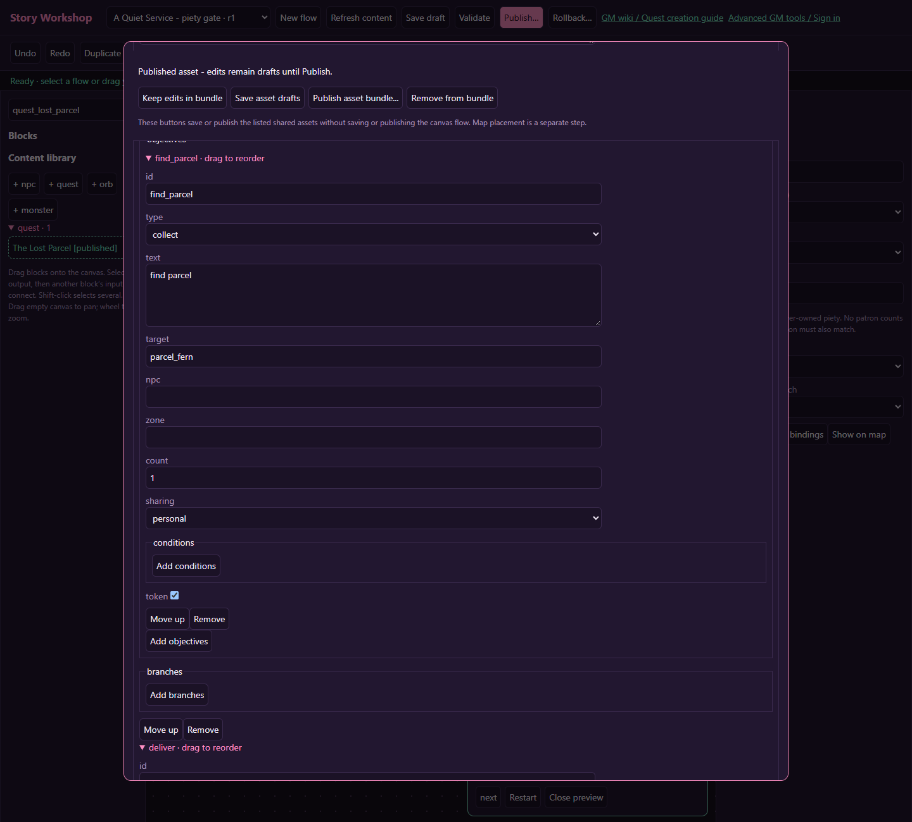
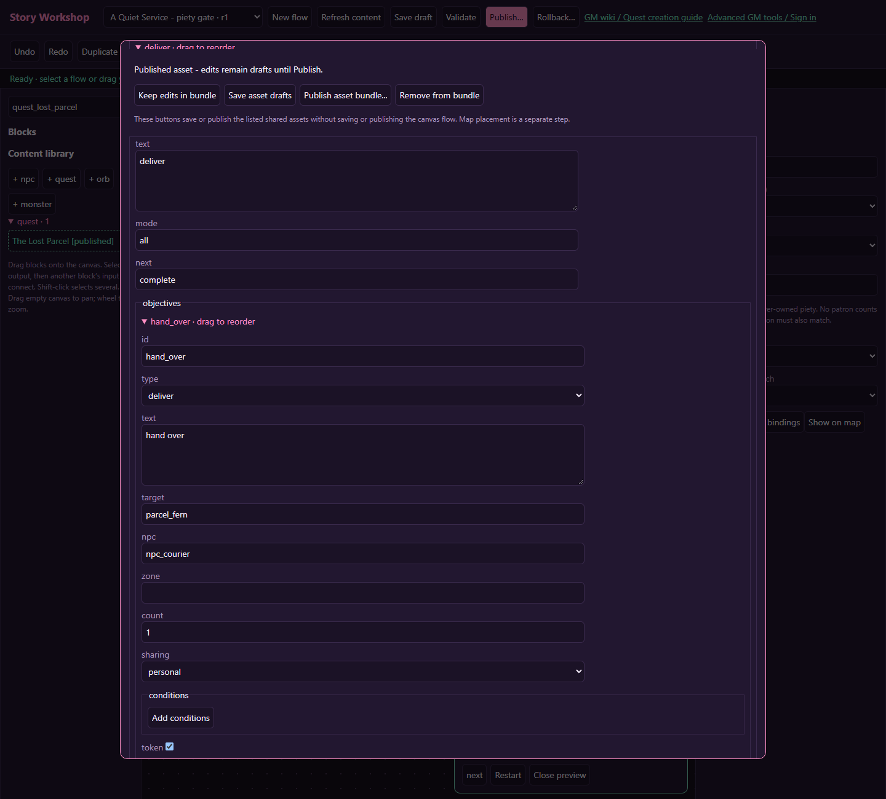

# Find and deliver: the lost parcel

[Wiki home](index.md) · [Objective reference](quests.md#objective-reference)

Courier Fern has lost a parcel. The player accepts the request, finds a placed quest token, and explicitly hands it to Fern. This recipe uses a **quest token**, not a normal inventory item, so a player cannot buy a substitute or sell the quest parcel.

## 1. Create the giver and journal quest

Use **+ npc** to create Courier Fern with a greeting explaining the missing parcel. Keep her stationary while testing. Save the asset draft and copy its generated ID.

Use **+ quest** to create “The Lost Parcel.” Add Fern's actual NPC ID under givers. Set repeat `once`, timer seconds `0`, turn-in mode `npc`, and turn-in NPC to Fern. Give a small reward such as 10 XP. Keep quest availability conditions empty for the first version.

## 2. Make a collection stage

Add a stage with ID `find`, mode `all`, next `deliver`, and one objective:

| Field | Value |
| --- | --- |
| id | `find_parcel` |
| type | `collect` |
| target | `parcel_fern` |
| token | checked |
| count | 1 |
| sharing | `personal` |
| text | Find Fern's parcel beside the marked path. |

`parcel_fern` is a content ID you choose for the token. It is not the generated placement ID. Keep its spelling identical on the objective, delivery objective and world placement.

## 3. Make a delivery stage

Add a second stage with ID `deliver`, mode `all`, next `complete`, and one objective:

| Field | Value |
| --- | --- |
| id | `hand_over` |
| type | `deliver` |
| target | `parcel_fern` |
| token | checked |
| npc | Fern's actual NPC ID |
| count | 1 |
| text | Return to Fern and choose Deliver. |

The two stages matter. Collection grants the quest token; delivery consumes it. A talk objective alone does not hand anything over. The delivery's `npc` and the quest's turn-in NPC may be different characters in a more advanced version, but keep them the same for this first delivery.

## 4. Publish and place both ends

Add the quest ID to Fern's **quests** list. Review **Publication bundle** and use **Publish asset bundle...** to publish the mutually referenced records together.

In **Zone map & placements**, place Fern using kind `npc` and her NPC ID. Choose a second reachable tile for kind `token`, set **Content / objective ID** to `parcel_fern`, and give it a clear label and artwork. Use lifetime `persistent` if the request should survive map regeneration. Place the parcel a short walk away, not under the NPC or on a blocked tile.

Do not use kind `interact` for this token: that emits an interaction event rather than a token collection event. A single placement supplies one collection credit per accepted stage; increasing count to 3 requires three distinct suitable token placements, not three clicks on one object.

## 5. Play the complete route

Accept the quest **before** looking for the token. A placed token appears only for a character with an active, incomplete collection objective matching its target ID, zone restriction and conditions. Walk onto it, click it from beside it, or stand beside it and press **E**. Check that the journal advances from find to deliver; the collected placement disappears for your character. Other eligible characters keep their own copy. Return to Fern, open the conversation, choose the delivery action, then claim the ready quest through its designated turn-in interaction. Confirm the reward appears once and the token is consumed.

Also check a premature visit to Fern, token invisibility before acceptance and after abandoning, a repeated token click, another character's independent attempt, and reconnecting after collection. The GM placement map always shows the authored token for editing, even when your player character cannot see it. Do not remove a required placement from a live quest without reviewing the affected accepted quests.

## Variation: deliver ordinary supplies

For real inventory items, uncheck token on both objectives and use a supported item's actual ID. Collection checks what the character holds, including items obtained before acceptance; delivery consumes actual items. Explain the item name and quantity in the journal. Test with fewer than the required number, exact quantity, extra stock, and insufficient reward inventory space. Never use an invented item ID in place of a quest token.
