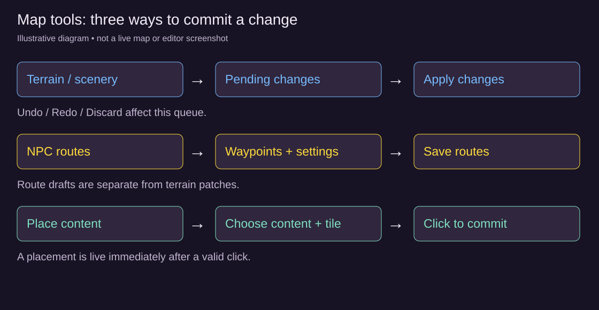

# Tutorial: edit a map and verify the result

[Wiki home](index.md)

This exercise introduces the live Map Editor's terrain, scenery and placement workflow. Use a local test server or a zone set aside for authoring. Applied patches and placed content affect the shared map; this is not a Story Workshop isolated-play preview.

## 1. Open and inspect

Choose **Pop out Map Editor** in the GM panel, or **Open in Map Editor** from the Zones tab. Select the zone, then **Fit**. Wheel to zoom; right-drag or Space-drag to pan. Turn on **grid**, **reachability**, and **players**. Select **Select / move** and hover over several tiles: the readout identifies terrain and content, including whether the tile is reachable.

Find an open, nonessential area away from arrivals, exits, services and active objectives. Full dungeons disable terrain-patch tools; use a supported overworld or hub instead. Download a **painted PNG** as a visual reference if useful. That picture is not a restorable map backup.

## 2. Practice a pending change

Select **Terrain brush**, choose **Wall (solid terrain)** and a **1 tile** brush. Paint one harmless floor tile. It appears in the preview and **Pending changes**; it has not yet been committed. Try **Undo**, **Redo**, then **Discard**. The pending preview should return to the live map without needing regeneration.

Repeat the brush action and choose **Apply changes**. Verify the updated patch revision and observe the obstacle with a test character in the zone. The server may refuse a change that covers protected content or strands a required destination; use its tile/reason message to choose another spot. Do not remove a service merely to bypass that refusal.

## 3. Add scenery without blocking a route

Choose **Scenery stamp**, select a shipped sprite and check its footprint dimensions and **solid** setting. Stamp it away from the patrol corridor. Inspect the pending change, apply it, and check the result in-game. A decorative object and a solid object can have different collision behavior even when both look small.

Use the scenery eraser to queue removal of the stamp, then apply again if you want to undo this experiment. Keep footprint and collision checks separate from the sprite's visible pixels. A large transparent sprite margin is not itself proof that a tile is passable.

## 4. Check paths before placing an NPC

The red reachability overlay marks walkable floor cut off from arrivals. Preserve a connected approach to the intended NPC position. **Place content** commits on the map click: choose a published NPC, choose Persistent or Temporary, then click a valid tile. Terrain Apply is not required to commit that placement.

Follow [Build an NPC patrol](tutorial-npc-patrol.md) to add movement. Finish required terrain changes before saving the route: the route preview can use a pending opening that is not on the live map yet. Route saves have their own **Save routes** control, and terrain Undo does not restore a discarded patrol.

## 5. Try the other tools deliberately

| Tool | Safe first exercise | Verify |
| --- | --- | --- |
| Safe room | On a supported map, click two opposite corners in the same connected open area, then Apply | The safe-room overlay covers the intended rectangle |
| Arrival spawn | Choose the default arrival or a neighbour's arrival, click a free walkable tile, then Apply | A fresh arrival uses that tile and can still reach services/exits |
| Biome layers | On a supported theme, select one available layer and change a small area | The matching cover, shore, wash, mist or crater overlay changes as intended |
| Exits & pads | Select an existing supported gate/pad and move it within its allowed geometry | The destination and usable arrival side remain correct |
| Hidden trap | In **Place content** choose kind **Trap**, pick a trap or **Random**, and click a free tile | A red diamond appears; a test character walks onto it, sees the trap scene once, and a second visit does nothing |

Trap placements are hidden from players and never block movement; edit the traps themselves in the GM panel's **Traps** tab. See [Floor traps](traps.md). Some tools only appear or enable on compatible map types. A gate stays on its existing wall when moved; code-defined building doors are not arbitrary movable gates. Adding a crossing uses permitted destinations, not a way to invent a new zone. See [the Map Editor reference](maps.md#the-map-editor-pop-out) for restrictions before changing travel.

## 6. Restore and inspect persistence

In **Patch layer**, use **Remove** for an individual stored change or **Roll back to** an earlier patch revision. **Clear patch** removes all stored changes for this zone, including other GMs' work; use it only in an agreed test area. These operations revert the patch in place, without regenerating the entire floor.

On a disposable test map, regenerate only after confirming the zone is safe to replace. Stored patches reapply where the new geometry permits them; refused operations are listed as skipped. Persistent content is realized on valid tiles, and NPC waypoints can shift or be dropped. Recheck content access, arrivals and patrols after regeneration rather than assuming their old coordinates still fit.

## Completion check

- You can tell a pending terrain preview from an applied patch or an immediate placement.
- Undo/Redo/Discard affect the pending queue; patch Remove/Roll back/Clear affect committed terrain changes.
- Your test character sees the geometry update and collides with the intended solid tiles.
- Services, entrances, exits and NPC interaction positions remain reachable.
- You know that patrols are saved separately and need review after geometry changes.
