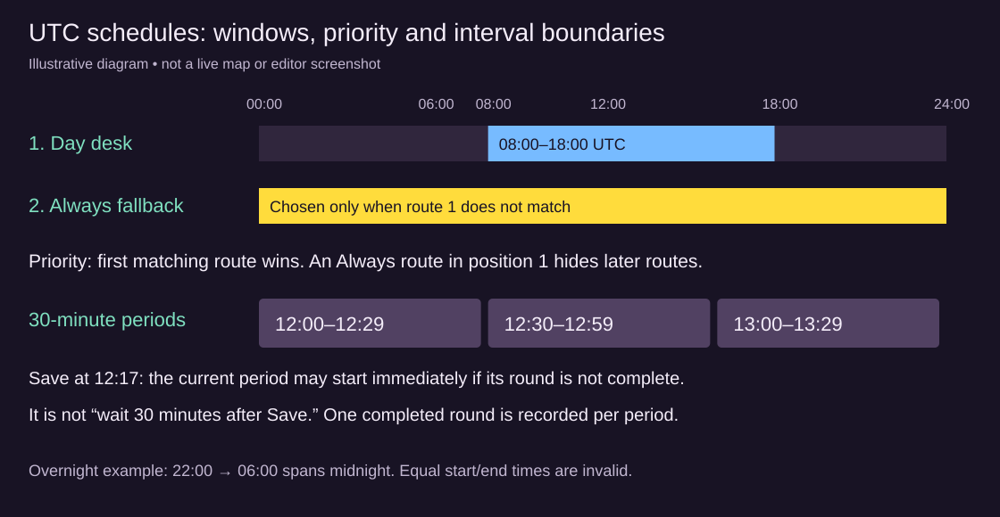

# Tutorial: daily work hours and timed rounds

[Wiki home](index.md)

Start with a published, placed NPC and a test player in the same zone. Use the [patrol tutorial](tutorial-npc-patrol.md) first if you have not drawn waypoints. These exercises change a live placement, so use a test server or a designated authoring area.

## 1. Give a clerk a daily workplace

Select the NPC with **NPC routes**. Start with no earlier Always route, because it would win before the daily route. Create **Day desk** as the first route, choose **Walk there and stay**, and place one destination on clear floor beside the desk, not on its solid/service fixture.

Set **When → Daily, between two times**, **From (UTC) → 08:00**, and **Until (UTC) → 18:00**. Choose **Save routes**. During the window, the clerk goes to the desk and stays there. Outside it, with no other matching route, the clerk walks home. The end is exclusive: 18:00 is already outside the daytime window.

For a quick live check, use the UTC clock displayed in the route controls and a short window around the current minute, with different start/end values. Save and stay in the zone across the boundary. Restore the intended hours afterward. Changing a tutorial diagram's settings does not change server time.

## 2. Add an after-hours fallback

Choose **+ route** after Day desk and name it **Evening courtyard**. Use **Back and forth**, **Always**, and two courtyard waypoints. Save. The order must be:

| Order | Route | Schedule | Expected result |
| --- | --- | --- | --- |
| 1 | Day desk | Daily 08:00–18:00 UTC | Wins during work hours |
| 2 | Evening courtyard | Always | Runs whenever Day desk does not match |

The Always route is a fallback because it is second. Putting it first would hide the desk route all day. Tabs select a route but do not reorder it. To repair the order, note the points/settings, delete the routes from the draft and recreate them in priority order before saving.

With an Always fallback, there is no unscheduled period, so the clerk does not automatically go home after work. Remove the fallback and save if going home is the intended behavior. A change of active route starts toward that route's first destination from the NPC's current location.

## 3. Make an overnight guard

On another test placement, create a daily patrol from **22:00 UTC** until **06:00 UTC**. An earlier end time intentionally spans midnight: the route is active late at night and before 06:00 the next day. It is inactive at 06:00. Equal times are refused; use Always for a whole-day patrol.

Confirm the conversion from your local time when setting hours. UTC does not follow local daylight-saving changes. The interface labels its fields **From (UTC)** and **Until (UTC)** for this reason.

## 4. Make a delivery round every 30 minutes

Use a separate NPC or temporarily replace the earlier routes so priority cannot hide this exercise. Name the route **Parcel round**, choose **When → One lap every N minutes**, and set **Minutes between laps → 30**. Choose **Walk there and stay** and add two or three delivery stops with waits of 2 seconds.

Despite that movement label, the interval schedule ends a traversal after the final stop and its wait, then the NPC heads home. It does not hold at the final stop for the whole half hour. A Loop interval also completes at its last waypoint; a Back and forth interval completes after returning to the first waypoint. A lower-priority matching route may take over after completion.

The 30-minute periods align to server time, such as 12:00–12:29 and 12:30–12:59 UTC. Saving at 12:17 can start the uncompleted round for that current period. It does not mean “wait 30 minutes from 12:17.” For a quick test, use a short route with a one-minute interval; avoid long waits that would carry the walk across several periods. Restore 30 minutes after testing.

## 5. Observe absence and interruptions

Keep one test player in the zone to watch continuous movement. Looking at the GM map alone does not keep the patrol active. Close conversations before judging a schedule: they pause the NPC. After an empty zone has gone unobserved for more than a minute, the next visitor may see the NPC resume at a schedule-appropriate stop instead of replaying missed walking.

Save route changes deliberately: saving restarts from home, and a regenerated map may shift or drop destinations. Reopen the placement after changing terrain, review any dropped-waypoint notice, and verify the desk and delivery stops still represent the right places.

## Completion check

- Daily work hours activate and end at the expected UTC boundaries.
- A second Always route acts as a fallback, not an override of the first route.
- An overnight window crosses midnight correctly.
- An interval round completes once per server-time period, then heads home or yields to another matching route.
- You tested with an actual player present and distinguished waiting, conversation pauses and blocked paths.

Keep [the route reference and troubleshooting table](npc-routes.md) open beside the Map Editor when adapting these examples.
