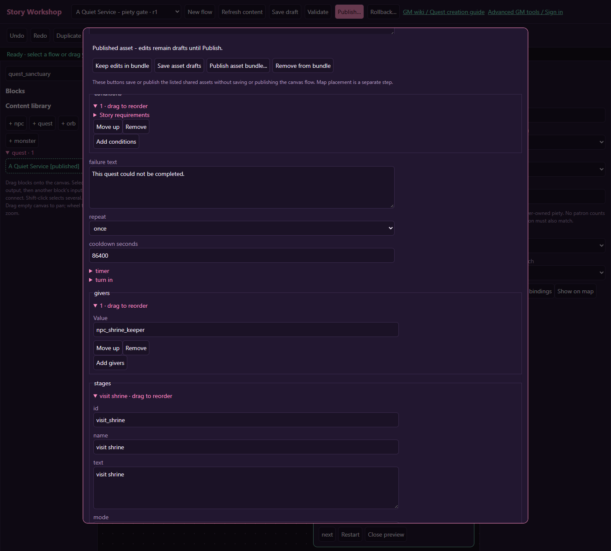
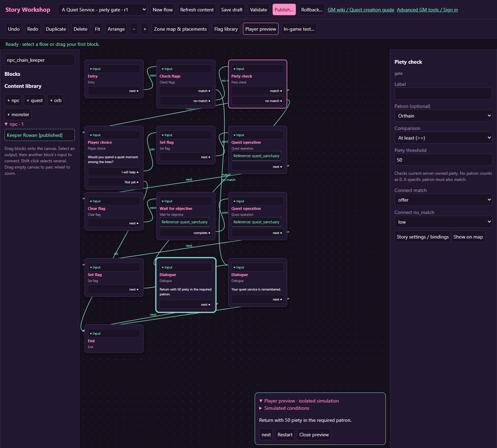

# A piety-gated quest: a quiet service

[Wiki home](index.md) · [Piety block reference](blocks.md#piety-check)

Offer a personal service only to an Orthain follower with at least 50 piety. The service asks the player to visit the Haunted Woods. Refusing or arriving with insufficient piety must allow another attempt; completing it must not pay twice.

## 1. Prepare the NPC, quest and flags

Create **Shrine Keeper** with a normal greeting, and a once-only journal quest called **A Quiet Service**. Use the keeper as its giver. Add a visit objective targeting `overworld-haunted-woods`, count 1, stage next `complete`, turn-in mode `journal`, and reward 10 XP. Set timer seconds to 0.

In **Flag library**, create these authored boolean flags:

| ID | Purpose |
| --- | --- |
| `story_sanctuary_permit` | Temporary permission for this flow to accept the quest |
| `story_sanctuary_done` | Remembers the successful service after the reward claim |

On the quest, expand **conditions**, add a condition, and add `story_sanctuary_permit` under its flag **All set** requirement. This prevents the keeper's ordinary quest menu from bypassing the piety gate. Do not put the permit condition on the objective: the flow clears the permit immediately after acceptance.

## 2. Build the admission path

Create a **New flow**, name it “A Quiet Service,” and enable **Repeatable** in Story settings. Add the blocks below. Rename their labels to match the table so connections remain easy to follow.

| From block | Output | Destination |
| --- | --- | --- |
| Entry | next | Already completed? — Check flags |
| Already completed? (`All set: story_sanctuary_done`) | match | Thank you again — Dialogue |
| Already completed? | no_match | Worthy service — Piety check |
| Worthy service | match | Offer service — Player choice |
| Worthy service | no_match | Return when ready — Dialogue |
| Offer service | accept | Grant permit — Set flag |
| Offer service | decline | End |
| Return when ready | next | End |

Set the Piety check's **Patron (optional)** to **Orthain**, **Comparison** to **At least (>=)**, and **Piety threshold** to **50**. Connect both outputs. A different patron fails even with 100 piety; an undedicated character fails too.

## 3. Connect acceptance and completion

Connect these in order:

1. **Set flag** `story_sanctuary_permit`.
2. **Quest operation**, operation `accept`, reference the service quest.
3. **Clear flag** `story_sanctuary_permit`.
4. **Wait for objective**, Wait for `quest`, reference the same quest.
5. **Quest operation**, operation `claim`, same reference.
6. **Set flag** `story_sanctuary_done`.
7. **Dialogue** thanking the player, then **End**.

The wait leaves the player free to travel. Do not leave a dialogue page open in front of the wait: story pages hold input until continued. Do not manually claim this tutorial's quest in the journal while its flow is waiting to claim it; let the flow own the claim path. Test that exact route.

Piety is checked at admission. Falling below 50 later does not cancel an accepted service. This block neither consumes piety nor grants a blessing. If you want a second check at completion, add one deliberately and explain the recovery route to the player.

## 4. Bind, publish and place

Add an NPC entry binding from Shrine Keeper to Entry. Save the flow and its assets, Validate, then Publish after reviewing the included quest and keeper. Place the keeper on a reachable tile. Players choose **Continue personal story** from the conversation to enter the gate.

## 5. Test the boundaries

Open **Player preview → Simulated conditions**. Test Orthain at 49, 50 and 51; another patron at 100; and no patron. Changing simulated faith restarts preview. Simulation does not change a real character's faith.

In an isolated in-game test, verify refusal/retry, acceptance, travel, a single claim, and the completed greeting. The preview-flag checkbox does not copy simulated piety into the game test; use the test character's faith or supported in-game GM faith controls inside the isolated session. Keep external web GM tools separate: those operate on real state.
