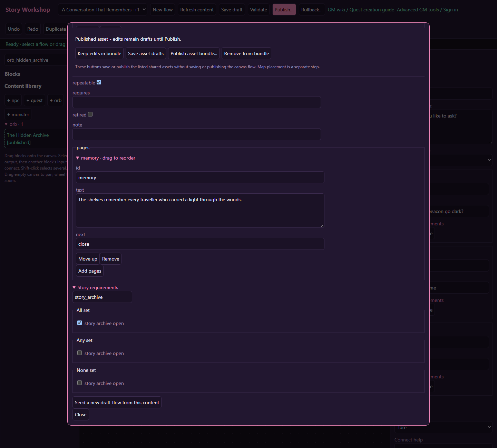
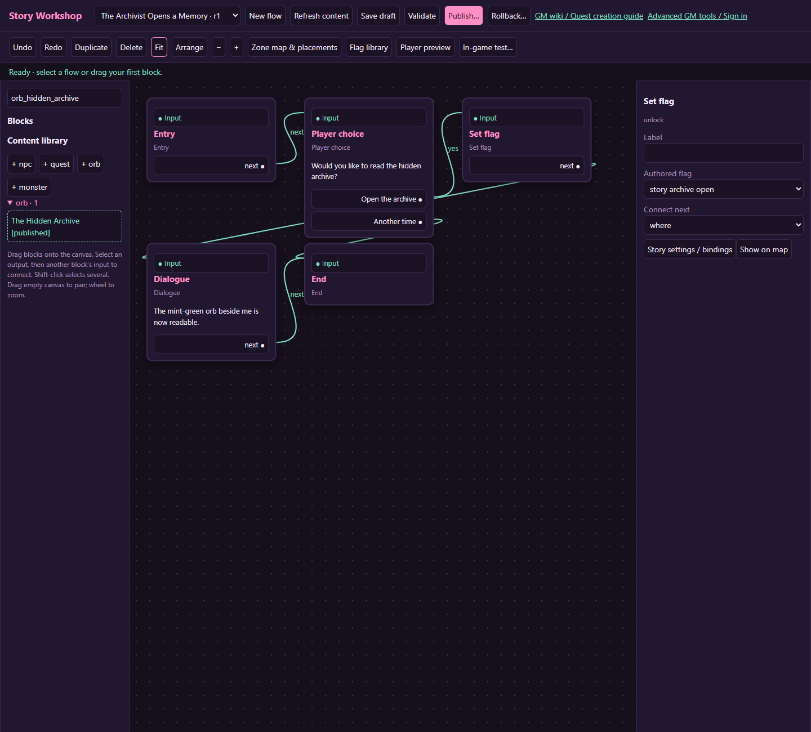

# Bonus tutorial: unlock a secret memory orb

[Wiki home](index.md) · [Orbs and artwork](orbs-art.md)

Archivist Lark offers access to a hidden memory. Accepting sets a personal flag, and a nearby mint-green orb becomes readable for that character. Declining changes nothing. This separates the NPC's decision from the orb's world placement and presentation.

## 1. Make the flag and the orb

Create `story_archive_open` in Flag library. Describe it as “The archivist has granted this character access.” Create an orb called **The Hidden Archive**, colour `#9bdac7`, and a first page `memory` whose next destination is `close`. Select approved artwork if available and write a short memory.

Set the orb's **story conditions → All set** to `story_archive_open`. Leave **requires** blank: that field means another orb must have been read first, not a story flag. Set repeatable on if the memory should be reread.

Save the orb draft. An unreadable orb can still be visible; the prerequisite gates access to reading it, not necessarily its appearance on the map.

## 2. Give the archivist a choice

Create Archivist Lark with a normal greeting. Make a repeatable flow and bind it to the NPC:

| Block | Connection |
| --- | --- |
| Entry | next → Ask permission |
| Ask permission — Player choice | yes → Unlock archive; no → End |
| Unlock archive — Set flag `story_archive_open` | next → Point the way |
| Point the way — Dialogue | next → End |

Use “Open the archive” and “Another time” as choice labels. The direction page should tell the player where the orb is, such as “Read the mint-green orb beside me.” No quest claim or currency reward is needed.

## 3. Publish the two parts

Publish the orb using **Publish asset bundle...**, then publish the NPC flow and its keeper draft. A flag relationship is not the same as a direct content reference: the flow's Set flag does not automatically add every orb that checks that flag to its publication bundle. Inspect both records deliberately.

Place Lark and the orb on separate reachable tiles through Zone map & placements. Use kinds `npc` and `orb` with their respective actual IDs. Keep them close enough that the direction text is accurate.

## 4. Verify character isolation

Try reading the orb before permission: it should refuse access. Decline the NPC's offer and retry the orb; it should remain locked. Accept the offer, finish the flow, then read the orb. On another character, access should still be locked.

After reconnecting, the granted character should retain access. With repeatable enabled, reading again should show the memory without granting extra rewards. If a scene should grant an item or run a battle, bind an explicit flow and use its supported blocks; ordinary orb pages are presentation only.

## Variation: a two-memory trail

Create a second orb and set its **requires** value to the first orb's ID. Now the player needs the first read receipt before the second becomes readable. Give each orb its own pages and placement. You may combine this with a flag condition, but test each missing requirement separately so the player receives useful directions.
