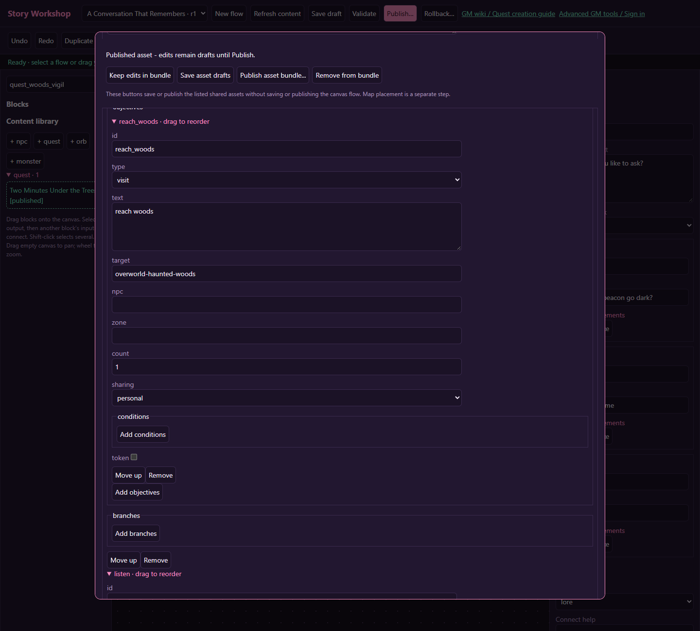
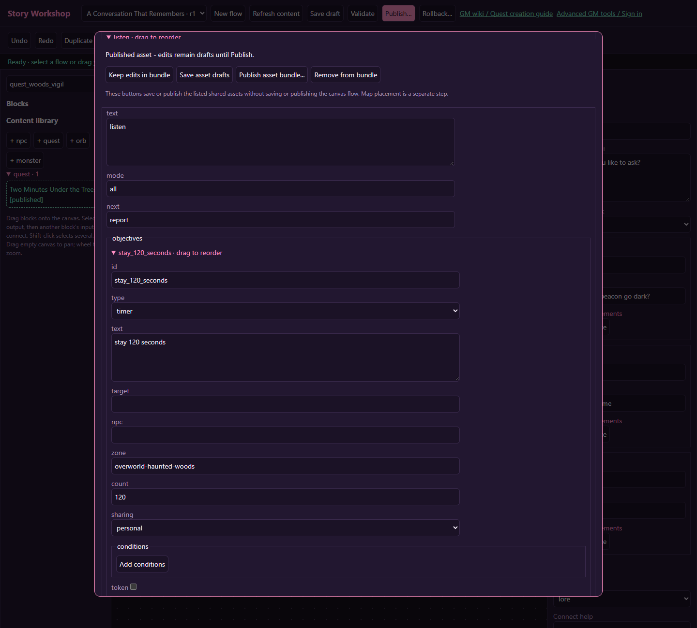

# Visit a zone and spend time there

[Wiki home](index.md) · [Quest timers](quests.md#timers-and-sharing)

Warden Moss asks the player to visit the Haunted Woods, spend two minutes listening there, then return with a report. This uses three journal stages and a **zone-qualified timer objective**. It measures accumulated connected time in that zone, not two minutes anywhere in the world.

This recipe requires the server update that implements zone-specific timer progress. Older servers ignored a timer objective's zone restriction; changing only the wiki does not fix that behavior.

## 1. Make the quest giver

Create Warden Moss with a stationary placement and an ordinary greeting. Create “Two Minutes Under the Trees,” add Moss under givers, and link its generated quest ID in Moss's quests list. Use repeat `once`, turn-in mode `journal`, and a small XP reward.

Set the quest-level **timer** mode to `online` and seconds to **0**. That disables the failure deadline. The two-minute requirement belongs in an objective's count; it is not the quest deadline.

## 2. Stage one: arrive

Add stage ID `arrive`, mode `all`, next `listen`. Add objective ID `reach_woods`, type `visit`, target **`overworld-haunted-woods`**, count **1**. Write “Travel to the Haunted Woods north of Honeydew Village.” Use the zone's actual ID, not its display name or a map's generation/edition identifier.

## 3. Stage two: listen for 120 seconds

Add stage ID `listen`, mode `all`, next `report`. Configure one objective:

| Field | Value |
| --- | --- |
| id | `stay_120_seconds` |
| type | `timer` |
| text | Spend two connected minutes in the Haunted Woods. Leaving pauses your progress. |
| target | blank |
| zone | `overworld-haunted-woods` |
| count | `120` |
| sharing | `personal` |
| token | unchecked |

Keep arrival and waiting in separate stages. Combining a visit and an unrestricted timer in one `all` stage would mean “have visited, and enough stage time has passed,” which is a different rule.

The timer starts accumulating only while this stage is active. Leaving pauses it, returning resumes it, and reaching the count completes the stage. It does not require standing still, staying on one tile, or avoiding battles. If you want an uninterrupted stay that resets on departure, this recipe does not provide that rule.

## 4. Stage three: report

Add stage ID `report`, next `complete`, with a `talk` objective targeting Moss's actual NPC ID, count 1. Write “Return and tell Warden Moss what you heard.” This makes the return journey a real objective. An NPC turn-in setting alone is not a substitute for every possible flow-controlled return path.

## 5. Publish and place

Save both drafts. Open Moss, inspect Publication bundle, and **Publish asset bundle...**. Place the NPC outside the listening zone if you want a distinct outward and return journey. No separate world objective placement is needed for a whole-zone visit or timer; the zone already exists.

If you want a specific clearing instead of the whole Woods, a location placement can detect reaching a tile, but it does not turn this timer into a radius-based stay detector. Keep the journal wording faithful to the actual rule.

## 6. Test time rather than guessing

| Action | Expected result |
| --- | --- |
| Wait outside before arrival | No listening credit |
| Enter and remain connected for about 30 seconds | Listening progress grows |
| Leave, wait, then return | Outside time contributes nothing; existing credit remains |
| Disconnect longer than the presence timeout | Credit stops when the server's presence lease expires |
| Reconnect after a long absence | The gap is not credited retroactively |
| Restart the service during the listening stage | Saved progress remains; service downtime does not count |
| Reach 120 seconds and talk to Moss | Quest becomes ready, then can be claimed once |

Presence uses a short server lease, so a connection loss can include up to the remaining lease interval, rather than stopping at an unknowable exact disconnect instant. Transition intervals are counted conservatively. Test with the journal's progress display and allow normal snapshot latency.
